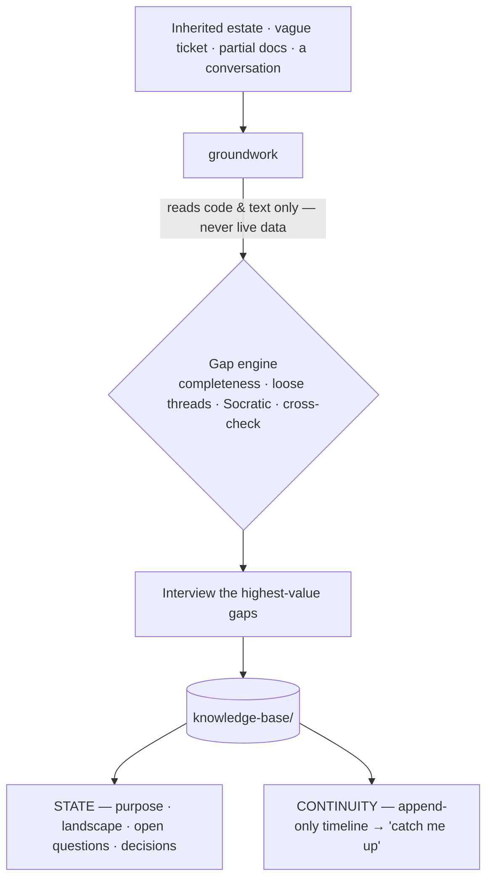

# bi-copilot

**A bench of senior BI & analytics mentors for [Claude Code](https://docs.claude.com/en/docs/claude-code) — an expert guide for the whole lifecycle of turning business uncertainty into decisions you can defend.**

Analytics work is rarely blocked by tools. It's blocked by *judgment*: a vague ask, a system nobody documented, a number you have to defend, a stakeholder you have to align. What you actually want isn't another dashboard generator — it's **a senior sitting beside you**. `bi-copilot` is that senior, delivered as an **architecture, not a chatbot**: a coherent method, broken into sharp skills you reach for when you need them, growing one mentor at a time.

 &nbsp; &nbsp; &nbsp;

---

## The idea

Every hard moment in an analyst's week is the same wish — *"I wish a senior were here."* They fall into **six gaps**:

| Gap | The moment it shows up |
|---|---|
| **Knowledge** | "I inherited this system and I don't understand it." |
| **Judgment** | "Is this number actually right — and would it survive scrutiny?" |
| **Craft** | "What's the clean way to model and build this?" |
| **Communication** | "I have to present this and defend it to stakeholders." |
| **Process** | "Where am I in this project, and what's the right next step?" |
| **Confidence** | "Am I even solving the right problem?" |

`bi-copilot` is a **bench of mentors**, each built to close one gap. You don't get a do-everything bot that's mediocre at all of it — you get a focused senior for the moment you're actually in.

## Philosophy — the design *is* the product

- **An architecture, grown by accretion.** Each mentor is a lean, individually-invokable skill. New mentors slot in without bloating the others; the practice scales by adding *sharp tools*, never by inflating one mega-prompt.
- **Comprehensive thinking, lean output.** It reasons against a full completeness model for your situation — then records only what matters. Rigor without bloat.
- **A read-only bright line, by design.** It reads code, object definitions, docs, and static extracts you hand it — and **never connects to a live system or computes the deliverable itself**. That one rule is what makes it safe inside a regulated, on-prem, no-egress shop.
- **Memory as a first-class output.** Everything it learns lands in a **living knowledge base** in your repo — *state* (the current truth) plus an append-only *timeline* (the history) — pointed at by an `AGENTS.md` so the next agent, or the next you, resumes instead of restarting.
- **Meet you where you are.** The guide is keyed to the analytics lifecycle — Understand → Define → Design → Build → Validate → Deliver → Operate — and builds on what's already known instead of re-interrogating you.

## The bench

| Mentor | Closes | Status |
|---|---|---|
| **`groundwork`** | **Knowledge** — get oriented on an unfamiliar project and build the knowledge base | ✅ **Available now** |
| requirements & stakeholder mentor | Communication · Confidence | planned |
| findings & recommendations mentor | Craft · Communication | planned |
| navigator — recommends your next move | Process | planned |

One mentor is live today — the one you reach for first, before any of the others can help. The bench grows from there.

## Available now: `groundwork`

The senior who walks you onto an unfamiliar estate — inherited pipelines, stored procedures, scheduled jobs, reports, a vague ticket, or nothing — reads what already exists (code and text only), interrogates what's missing, and leaves a living knowledge base behind.

**Before:** a blank page and a pile of someone else's objects.
**After:** a `knowledge-base/` in the repo. From one inherited transform and a one-line ticket, reading code only, it surfaces what you didn't know to ask:

```markdown
# open-questions.md  (excerpt)
- [ ] Nothing in the estate populates `StagingTable` — what feeds it, and must it run first?  (freshness risk)
- [ ] The load is hard-filtered to a single region with no comment — bug, or intentional scope?
- [ ] Who consumes the output table? That defines what "right" even means.
```

…plus a lineage map, a decisions log, and a dated timeline — all from artifacts, no database touched.

### How it works



Classify the project → ingest what you point it at (read-only) → run the four-mechanism gap engine → interview you for the highest-value gaps → write the knowledge base and append the timeline → report the picture, the open questions, and the single best next move.

## Install

In Claude Code:

```text
/plugin marketplace add <git-url-or-path-to-this-repo>
/plugin install bi-copilot@bi-copilot
```

Restart, then just describe your situation — no command needed:

> "I just inherited this reporting pipeline and I don't understand it. Where do I start?"

`groundwork` takes it from there.

## FAQ

**Why a bench instead of one big assistant?** Because a focused mentor that's genuinely senior-grade beats a broad bot that's mediocre everywhere. The architecture is built so each gap gets a sharp, dedicated skill — and so the suite can grow without any one part rotting into a do-everything prompt.

**Why only one skill today?** On purpose. A new mentor ships when it can be genuinely senior-grade at its gap — not before. `groundwork` is first because orientation comes first: you can't define, build, or defend anything until you understand what you're standing on.

**Does it touch my data?** No. It reads code, definitions, docs, and static extracts you hand it, and refuses to connect to or query a live system. When data profiling is needed at scale, it hands off rather than reaching for the database.

**Does it only work with one stack?** No — the method is stack-agnostic. Pipelines, procedures, jobs, reports, notebooks; any platform. Examples are just examples.

**Where does the knowledge base live?** As markdown in your project repo (`knowledge-base/` + an `AGENTS.md` pointer), versioned with the work and readable by both you and other agents.

## License

[MIT](LICENSE).
