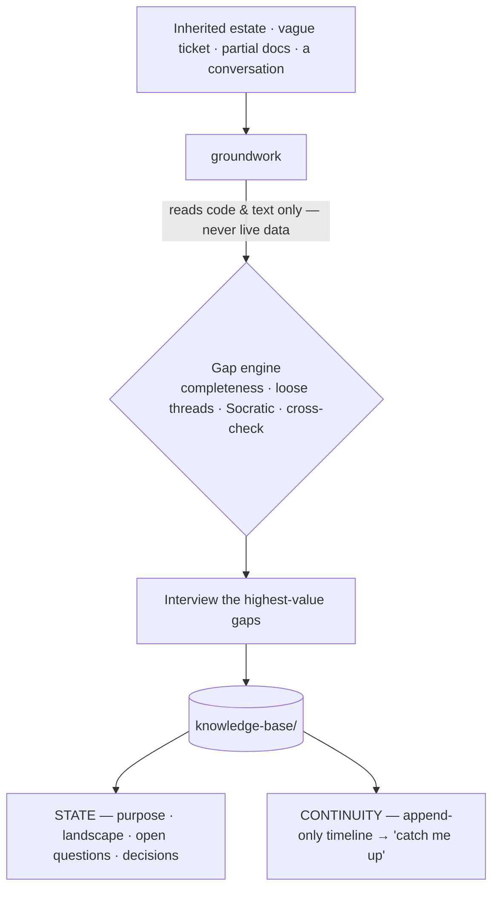

# bi-copilot

**Your expert copilot for analytics delivery — a second set of hands *and* a sparring partner.**

You make the calls. bi-copilot orients you on systems nobody documented, pins down what a metric actually means, preps you for the stakeholder meeting, pressure-tests your analysis before your reviewer does, holds the thread across months of interruptions, and always knows the next move — carrying a vague ask all the way to a decision you can defend.

An expert partner for [Claude Code](https://docs.claude.com/en/docs/claude-code), built as an architecture that grows — not a one-shot chatbot.

 &nbsp; &nbsp; &nbsp;

---

## Why

You're good at this. That isn't the problem.

The problem is that good analytics delivery is a dozen disciplines run in parallel — orientation, definition, rigor, documentation, stakeholder comms, decision-tracking, knowing what's next — and under interrupt-driven, often-solo reality, the disciplines are the first thing to slip. The thread gets lost between context-switches. The metric never got pinned down before the dashboard got built. The meeting prep got skipped. The rationale for that call lives only in your head — until someone asks six weeks later, or you hand the project off, or the person who knew it leaves.

bi-copilot runs those disciplines for you — tirelessly, every time — so your expertise goes to the calls only you can make. And on the calls that are genuinely hard, it doesn't just take notes: it spars.

## The panel

It's a copilot — so think of it as the board. You fly; it runs everything else.

| System | What bi-copilot does | Status |
|---|---|---|
| **Pre-flight** | Orient on an undocumented or inherited system before you touch it; build the knowledge base | ✅ **live** |
| **Checklists** | Completeness models per project type + a four-way gap engine — rigor that doesn't depend on your memory | ✅ **live** |
| **Logbook** | A living knowledge base: current state + an append-only timeline, event capture, "catch me up," decision provenance | ✅ **live** |
| **Flight plan** | The whole delivery lifecycle, its milestones, and the discovery↔definition↔analysis↔review↔evolution loops — with a navigator that calls your next move | ◐ coming online |
| **Comms** | Stakeholder & meeting preparedness — prep packs, the questions to ask, the KPI contract, the findings brief | ◐ coming online¹ |
| **Sparring** | Defend-the-number rehearsal, Socratic challenge, red-teaming the analysis before your reviewer or stakeholder does | ◐ coming online² |
| **Instruments** | Data quality, lineage — *is this right, and will it hold?* | ◐ coming online¹ |

¹ `groundwork` already drafts several of these as knowledge-base artifacts (KPI contract, lineage map, findings, meeting briefing); the dedicated, interactive modules come next. &nbsp; ² the Socratic challenge is live inside `groundwork` today.

## What you can ask it

You don't run commands — you describe what you're dealing with, and the right capability picks it up. A sample across the lifecycle (today, every ✅ runs through `groundwork`; the ◐ rows show where the panel is headed):

| Stage | You say… | What happens | Status |
|---|---|---|---|
| Understand | "I inherited this pipeline and don't get it — where do I start?" | Classifies the estate, reads it (code only), surfaces the unknowns, starts the knowledge base | ✅ |
| Understand | "What don't I know about this system that I should?" | Runs the four-way gap engine and lists the highest-value unknowns | ✅ |
| Continuity | "Catch me up — I've been off this for three weeks." | Reads the timeline + state and briefs you: where you are, what changed, what's next | ✅ |
| Define | "The ticket just says 'improve sales reporting' — what do they actually need?" | Separates the stated ask from the real decision it has to support | ◐ |
| Define | "Pin down what 'active customer' actually means before we build." | Drafts a KPI contract — definition, grain, formula, source, caveats, owner | ◐ |
| Design | "What's the cleanest, most maintainable way to model this?" | Talks through the trade-offs and the failure modes to avoid | ◐ |
| Build | "We decided to exclude refunds — capture that and why." | Logs the decision with its rationale and provenance, so it's never re-litigated | ✅ |
| Validate | "Pressure-test this before my lead sees it — what would they attack?" | Red-teams your reasoning; surfaces the weakest links and the questions you'll get | ◐ |
| Validate | "Is this number defensible? Rehearse defending it with me." | Plays the skeptic — the holes, the challenges, how you'd answer each | ◐ |
| Deliver | "Turn these findings into a brief I can send." | Structures observation → implication → recommended action → what to watch | ◐ |
| Deliver | "Show me where these numbers actually come from." | Builds a lineage map from the code you've pointed it at | ✅ |
| Operate | "What's the right next move on this project?" | Infers where you are from the knowledge base and recommends the next step | ◐ |
| Continuity | "The client just emailed a new constraint — log it." | Drops a dated event on the timeline with its source | ✅ |

✅ live today (via `groundwork`) · ◐ on the flight plan

## Philosophy — the design *is* the product

- **A peer, not a tutor.** It operates at your level: it does the work that's beneath you and argues with you about the work that isn't. No hand-holding, no lectures.
- **An architecture, grown by accretion.** Each capability is a lean, sharp, individually-invokable skill. New ones slot in without bloating the others; the practice scales by adding instruments, never by inflating one mega-prompt.
- **Comprehensive thinking, lean output.** It reasons against the *full* model of your situation — then records only what matters. Rigor without bloat.
- **A read-only bright line, by design.** It reads code, object definitions, docs, and static extracts you hand it — and never connects to a live system or computes the deliverable itself. That one rule is what makes it safe inside a regulated, on-prem, no-egress shop.
- **Memory is the product, not a side effect.** Everything it learns lands in a knowledge base in your repo — `state` + an append-only `timeline` — pointed at by an `AGENTS.md`, so the next agent (or the next you) resumes instead of restarting cold.

## Live now: `groundwork`

The first instrument on the board — pre-flight. Point it at an unfamiliar estate: inherited pipelines, stored procedures, scheduled jobs, reports, a vague ticket, or nothing at all. Reading code and text only, it interrogates what's missing and leaves a living knowledge base behind.

**Before:** a blank page and a pile of someone else's objects.
**After:** a `knowledge-base/` in the repo. From one inherited transform and a one-line ticket — reading code only — it surfaces what you didn't know to ask:

```markdown
# open-questions.md  (excerpt)
- [ ] Nothing in the estate populates `StagingTable` — what feeds it, and must it run first?  (freshness risk)
- [ ] The load is hard-filtered to a single region with no comment — bug, or intentional scope?
- [ ] Who consumes the output table? That defines what "right" even means.
```

…plus a lineage map, a decisions log, and a dated timeline — all from artifacts, no database touched.

### How it works



Classify the project → ingest what you point it at (read-only) → run the four-mechanism gap engine → interview you for the highest-value gaps → write the knowledge base and append the timeline → report the picture, the open questions, and the single best next move.

## Flight plan

`groundwork` is live first because orientation comes first — you can't define, build, or defend anything until you know what you're standing on. From there the panel comes online by accretion: the navigator (where am I, what's next), the stakeholder/meeting and KPI-contract modules, the sparring / defend-the-number module, the findings package. Each ships when it can be genuinely expert-grade — not before.

## Install

In Claude Code:

```text
/plugin marketplace add <git-url-or-path-to-this-repo>
/plugin install bi-copilot@bi-copilot
```

Restart, then just describe your situation — no command needed:

> "I just inherited this reporting pipeline and I don't understand it. Where do I start?"

`groundwork` takes it from there.

## FAQ

**I already know what I'm doing — why would I use this?** Because expertise isn't your bottleneck; bandwidth and continuity are. You *could* run a completeness check on every project, journal every decision, keep a living knowledge base, and prep every meeting — but solo, under constant interruption, you won't, every time. bi-copilot runs those disciplines tirelessly so your judgment goes where only it can. And on the hard calls it spars — so you've already heard the toughest question before you're in the room.

**Why is so much "coming online," with one module live?** On purpose. A module ships when it can be genuinely expert-grade at its job — not before. The architecture is built for the full panel; better one instrument you trust than seven you don't.

**Does it touch my data?** No. It reads code, definitions, docs, and static extracts you hand it, and refuses to connect to or query a live system. When data profiling is needed at scale, it hands off rather than reaching for the database.

**Does it only work with one stack?** No — the method is stack-agnostic. Pipelines, procedures, jobs, reports, notebooks; any platform. Examples are just examples.

**Where does the knowledge base live?** As markdown in your project repo (`knowledge-base/` + an `AGENTS.md` pointer), versioned with the work and readable by both you and other agents.

## License

[MIT](LICENSE).
