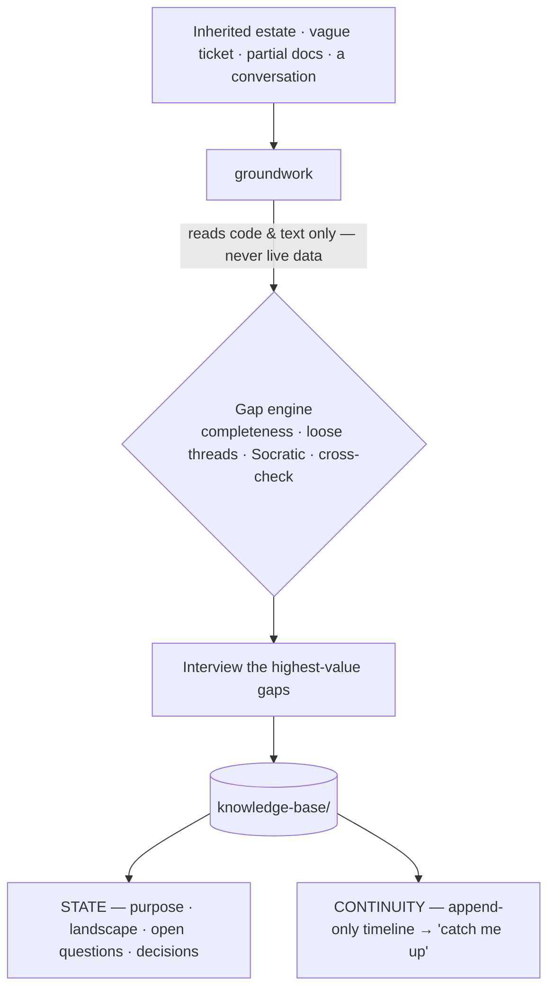

# bi-copilot

**The senior who walks you onto an unfamiliar data estate — reads what already exists, interrogates what's missing, and leaves behind a living knowledge base you and your agents can resume from.**

Every AI-for-analytics tool starts *after* the data and the model exist — *"here's a clean dataset, now ask it questions."* `bi-copilot` starts **before** that: at the messy, undocumented estate you just inherited, the one-line ticket, the project you've lost the thread on. It's an expert guide for [Claude Code](https://docs.claude.com/en/docs/claude-code), delivered as a **bench of senior mentors grown one skill at a time** — not a do-everything chatbot.

 &nbsp; &nbsp; &nbsp;

---

## Why it exists

- **The "before" gap.** Vendor copilots assume a clean, modeled dataset. Real work starts in the dark — someone's undocumented pipelines, a vague ticket, tribal knowledge that left with the last engineer. Nothing helps you *get your bearings*.
- **Read-only by design.** It reads code, object definitions, docs, and static extracts you hand it. It **never connects to or queries a live system** — no egress. Safe to point at work you can't pipe to the cloud.
- **It writes things down.** The output isn't a chat you scroll back through — it's a `knowledge-base/` committed beside the project: what the estate does, what's still unknown, what was decided and why, and a *"catch me up"* you can run weeks later.
- **Stack-agnostic.** Pipelines, stored procedures, scheduled jobs, reports, notebooks — any stack. The *method* is the product, not a vendor integration.
- **Zero dependencies.** Pure-markdown skills. Nothing to install but the plugin.

## The problem

You inherit a system nobody documented. The author is gone. There's a transform here, a scheduled job there, a report "everyone uses," and a ticket that says *"make sure the numbers are right."* The advice you get is *"just dig in."* So you dig — and three interrupts later you've lost the thread and you're re-deriving what you worked out last week.

`bi-copilot` is the senior who'd sit beside you for that first week — and unlike a senior, it never forgets what you found.

## Before → After

**Before:** a blank page and a pile of someone else's objects.

**After:** a `knowledge-base/` in the repo. From a single inherited transform and a one-line ticket, reading code only, `groundwork` surfaces what you didn't know to ask:

```markdown
# open-questions.md  (excerpt)
- [ ] Nothing in the estate populates `StagingTable` — what feeds it, and must it run first?  (freshness risk)
- [ ] The load is hard-filtered to a single region with no comment — bug, or intentional scope?
- [ ] Who consumes the output table? That defines what "right" even means.
```

…plus a lineage map, a decisions log, and a dated timeline entry — all from artifacts, no database touched.

## How it works



Classify the project → ingest what you point it at (read-only) → run the four-mechanism gap engine to find what's unknown → interview you for the highest-value gaps → write the knowledge base and append the timeline → report the picture, the open questions, and the single best next move.

## Architecture & philosophy

The design *is* the point:

- **A bench, not a megaskill.** A thin router persona routes to sharp, individually-interactive sub-skills, and the suite **grows by accretion**. Each skill stays lean and does one thing a senior would do; new skills slot in without bloating the others.
- **The six gaps.** Every "I wish a senior were here" moment is one of six gaps — *Knowledge, Judgment, Craft, Communication, Process, Confidence.* The bench exists to close them one at a time. `groundwork` attacks the first: knowing where you are.
- **Comprehensive thinking, lean output.** It checks everything against a completeness model for the project type — then records only what matters. A thorough check never means a bloated knowledge base.
- **The bright line as a design principle, not a disclaimer.** Reading and profiling artifacts you provide is in scope; touching a live system or computing the deliverable is not. That single rule is what makes it safe to run inside a regulated, on-prem, no-egress environment.
- **Knowledge base = state + continuity.** Two halves of project memory: *state* (the current truth, overwritten as you learn) and an append-only *timeline* (the history, journaled each session). Pointed at by an `AGENTS.md` so the next agent — or the next you — resumes instead of restarting.

## Install

In Claude Code:

```text
/plugin marketplace add <git-url-or-path-to-this-repo>
/plugin install bi-copilot@bi-copilot
```

Restart, then just describe your situation — no command needed:

> "I just inherited this reporting pipeline and I don't understand it. Where do I start?"

`groundwork` takes it from there.

## What's inside

| Skill | Does |
|---|---|
| `groundwork` | Get oriented on an unfamiliar project and build the living knowledge base. |

That's v1 — deliberately one sharp skill. The bench grows by accretion as the next gaps get their mentor.

## FAQ

**Why not just ask Claude directly?** You can — and you'll get an answer you lose. `groundwork` imposes a method (completeness model, gap engine, capture-as-you-go) and leaves a durable, agent-readable artifact behind. The value is the discipline and the memory, not a one-off reply.

**Does it touch my data?** No. It reads code, definitions, docs, and static extracts you hand it, and refuses to connect to or query a live system. When data profiling is needed at scale, it hands off rather than reaching for the database.

**Does it only work with one stack?** No. The method is stack-agnostic — pipelines, procedures, jobs, reports, notebooks. Examples are just examples.

**Where does the knowledge base live?** As markdown in the project repo (`knowledge-base/` + an `AGENTS.md` pointer), so it's versioned with the work and readable by both you and other agents.

## License

[MIT](LICENSE).
