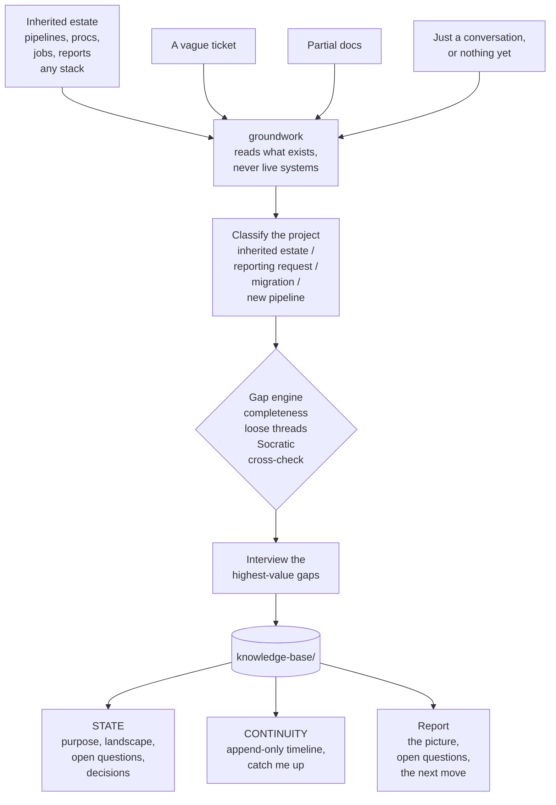
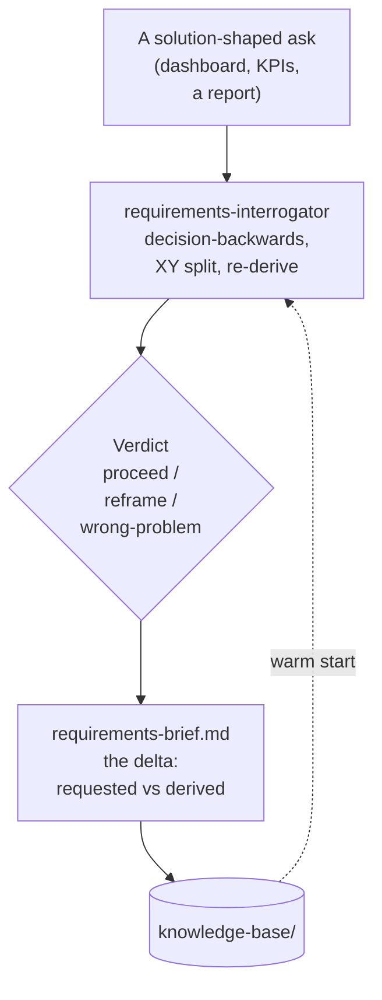
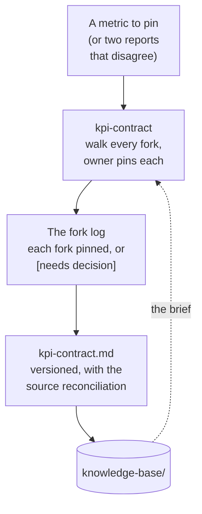
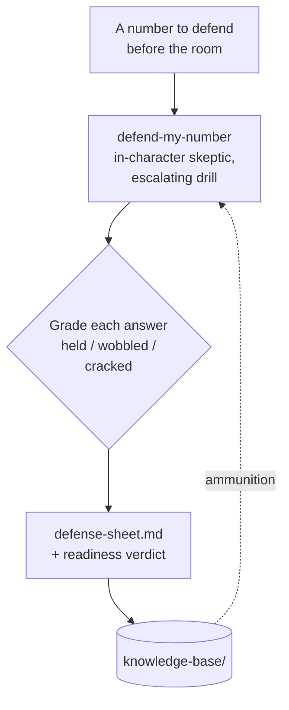
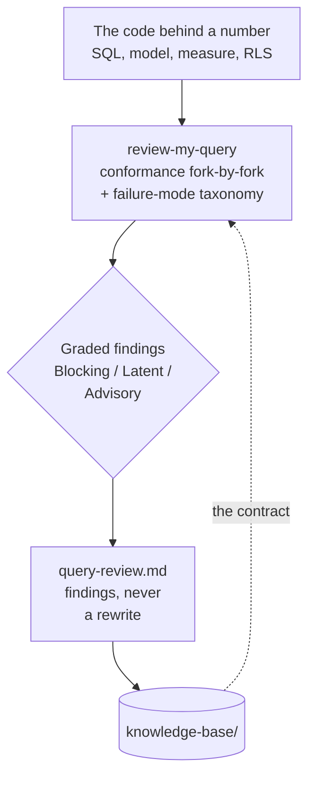
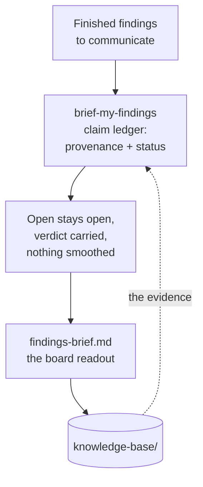

# bi-copilot

**Your expert copilot for analytics delivery: a second set of hands *and* a sparring partner.**

You make the calls. bi-copilot orients you on systems nobody documented, pins down what a metric actually means, preps you for the stakeholder meeting, pressure-tests your analysis before your reviewer does, holds the thread across months of interruptions, and always knows the next move, carrying a vague ask all the way to a decision you can defend.

An expert partner for [Claude Code](https://docs.claude.com/en/docs/claude-code), built as an architecture that grows, not a one-shot chatbot.

 &nbsp; &nbsp; &nbsp;

---

## Why

You're good at this. That isn't the problem.

The problem is that good analytics delivery is a dozen disciplines run in parallel: orientation, definition, rigor, documentation, stakeholder comms, decision-tracking, knowing what's next. Under interrupt-driven, often-solo reality, the disciplines are the first thing to slip. The thread gets lost between context-switches. The metric never got pinned down before the dashboard got built. The meeting prep got skipped. The rationale for that call lives only in your head, until someone asks six weeks later, or you hand the project off, or the person who knew it leaves.

bi-copilot runs those disciplines for you, tirelessly and every time, so your expertise goes to the calls only you can make. And on the calls that are genuinely hard, it doesn't just take notes: it spars.

## The panel

It's a copilot, so picture the board. You fly; it runs everything else.

| System | What bi-copilot does | Powered by | Status |
|---|---|---|---|
| **Pre-flight** | Orient on an undocumented or inherited system before you touch it; build the knowledge base | `groundwork` | ✅ **live** |
| **Checklists** | Completeness models per project type plus a four-way gap engine, so rigor doesn't depend on your memory | `groundwork` | ✅ **live** |
| **Logbook** | A living knowledge base: current state, an append-only timeline, event capture, "catch me up," decision provenance | `groundwork` | ✅ **live** |
| **Flight plan** | The whole delivery lifecycle, its milestones, and the discovery↔definition↔analysis↔review↔evolution loops, with a navigator that calls your next move | navigator *(planned)* | ◐ planned |
| **Comms** | Stakeholder and requirements work: interrogate a request down to the real decision before you build, the questions to ask, the KPI contract, the findings brief | `requirements-interrogator`, `kpi-contract`, `brief-my-findings` | ✅ **live** |
| **Review** | Read the query, model, or measure that computes a number and check it against its locked definition before it ships: catch the bugs that quietly ship the wrong number | `review-my-query` | ✅ **live** |
| **Sparring** | Defend-the-number rehearsal: role-plays the skeptic, drills you under escalating pressure, grades your answers, leaves a Defense Sheet. Socratic challenge and red-teaming too | `defend-my-number` | ✅ **live** |
| **Instruments** | Data quality and lineage: *is this right, and will it hold?* | `groundwork` drafts these; dedicated modules *(planned)* | ◐ planned |

## What you can ask it

You don't run commands. You describe what you're dealing with, and the right capability picks it up. A sample across the lifecycle (the ✅ rows are live across `groundwork`, `requirements-interrogator`, `kpi-contract`, `defend-my-number`, `review-my-query`, and `brief-my-findings`; the ◐ rows show where the panel is headed):

| Stage | You say… | What happens | Status |
|---|---|---|---|
| Understand | "I inherited this pipeline and don't get it, where do I start?" | Classifies the estate, reads it (code only), surfaces the unknowns, starts the knowledge base | ✅ |
| Understand | "What don't I know about this system that I should?" | Runs the four-way gap engine and lists the highest-value unknowns | ✅ |
| Continuity | "Catch me up, I've been off this for three weeks." | Reads the timeline and state, then briefs you: where you are, what changed, what's next | ✅ |
| Define | "The ticket just says 'improve sales reporting,' what do they actually need?" | Interrogates the request down to the real decision, then surfaces the gap between what was asked for and what that decision needs | ✅ |
| Define | "Pin down what 'active customer' actually means before we build." | Walks every fork the definition hides, pins each with the owner, states the source reconciliation, and locks a versioned KPI contract | ✅ |
| Design | "What's the cleanest, most maintainable way to model this?" | Talks through the trade-offs and the failure modes to avoid | ◐ |
| Build | "We decided to exclude refunds, capture that and why." | Logs the decision with its rationale and provenance, so it's never re-litigated | ✅ |
| Build | "I wrote the query behind this metric, is it right before it ships?" | Reviews the code against the locked definition, hunts the bugs that ship a wrong number, grades them and points the fix | ✅ |
| Validate | "Pressure-test this before my lead sees it, what would they attack?" | Role-plays the skeptic and drills you under pressure, grades each answer, leaves a Defense Sheet of the holes to fix | ✅ |
| Validate | "Is this number defensible? Rehearse defending it with me." | Plays the skeptic: the holes, the challenges, how you'd answer each | ✅ |
| Deliver | "Turn these findings into a brief I can send." | Composes the brief from your evidence, every claim sourced and graded, observation → implication → action → watch-for, with the open questions kept open and the verdict carried | ✅ |
| Deliver | "Show me where these numbers actually come from." | Builds a lineage map from the code you've pointed it at | ✅ |
| Operate | "What's the right next move on this project?" | Infers where you are from the knowledge base and recommends the next step | ◐ |
| Continuity | "The client just emailed a new constraint, log it." | Drops a dated event on the timeline with its source | ✅ |

✅ live today (via `groundwork`, `requirements-interrogator`, `kpi-contract`, `defend-my-number`, `review-my-query`, and `brief-my-findings`) · ◐ on the flight plan

## Philosophy: the design *is* the product

- **A peer, not a tutor.** It operates at your level: it does the work that's beneath you and argues with you about the work that isn't. No hand-holding, no lectures.
- **An architecture, grown by accretion.** Each capability is a lean, sharp, individually-invokable skill. New ones slot in without bloating the others; the practice scales by adding instruments, never by inflating one mega-prompt.
- **Comprehensive thinking, lean output.** It reasons against the *full* model of your situation, then records only what matters. Rigor without bloat.
- **A read-only bright line, by design.** It reads code, object definitions, docs, and static extracts you hand it, and never connects to a live system or computes the deliverable itself. That one rule is what makes it safe inside a regulated, on-prem, no-egress shop.
- **Memory is the product, not a side effect.** Everything it learns lands in a knowledge base in your repo (`state` plus an append-only `timeline`), pointed at by an `AGENTS.md`, so the next agent (or the next you) resumes instead of restarting cold.

## Skill: `groundwork`

The first instrument on the board: pre-flight. Point it at an unfamiliar estate: inherited pipelines, stored procedures, scheduled jobs, reports, a vague ticket, or nothing at all. Reading code and text only, it interrogates what's missing and leaves a living knowledge base behind.

**Before:** a blank page and a pile of someone else's objects.
**After:** a `knowledge-base/` in the repo. From one inherited transform and a one-line ticket, reading code only, it surfaces what you didn't know to ask:

```markdown
# open-questions.md  (excerpt)
- [ ] Nothing populates `StagingTable`. What feeds it, and must it run first?  (freshness risk)
- [ ] The load is hard-filtered to a single region with no comment. Bug, or intentional scope?
- [ ] Who consumes the output table? That defines what "right" even means.
```

…plus a lineage map, a decisions log, and a dated timeline, all from artifacts, no database touched.

### How it works



Classify the project → ingest what you point it at (read-only) → run the four-mechanism gap engine → interview you for the highest-value gaps → write the knowledge base and append the timeline → report the picture, the open questions, and the single best next move.

## Skill: `requirements-interrogator`

The second skill to go live. When a stakeholder hands you a solution (named KPIs, a dashboard, a report) instead of a decision, it interrogates the request down to the decision that solution is meant to serve, then shows the gap between what was asked for and what the decision actually needs.

**Before:** "Build me a dashboard with daily active users, session length, and bounce rate."
**After:** the interrogation surfaces the real decision (keep investing in Feature A, or not), re-derives the metric that actually answers it (a Feature-A retention cohort), and returns a one-page brief with the requested-vs-derived delta and a verdict: proceed, reframe, or wrong-problem. No database touched. If the stakeholder is out, it hands you the exact questions to go ask instead of inventing their answers.

A capable assistant already defines metrics carefully and checks feasibility, then builds the thing it was handed. This runs the move it skips: validate the problem first, so you build the right thing once.

### How it works



## Skill: `kpi-contract`

The metric pinner. You're about to define a metric, lock it for a build team, or settle two reports that disagree on "the same" number. It walks every choice the definition silently makes, forces each to be pinned by the owner or flagged as an open decision, ties the metric to its source of record, and locks it as a versioned contract.

**Before:** "Define marketing-attributed revenue for the QBR. Last quarter our number and Finance's were far apart and it got awkward."
**After:** instead of one clean definition, it produces a fork log: revenue basis (bookings vs recognized), refunds (gross vs net), attribution model, period basis (calendar vs fiscal), and the rest, each pinned with a rationale or marked as the owner's call, plus the explicit reconciliation to Finance's total. The result is a committable KPI contract, versioned and ready to hand off. No database touched, no number computed.

A capable assistant already writes a plausible definition and even recommends defaults. This runs the move it skips: surface every fork, let the owner pin it, and never let the data you happen to have define the metric.

### How it works



## Skill: `defend-my-number`

The sparring partner. You have a number, finding, or recommendation you'll have to defend in a room. It role-plays the skeptic you're about to face (the steamrolling exec, the data-method skeptic, the political pressurer who wants a different answer), drills you under escalating pressure one attack at a time, grades each answer honestly (held, wobbled, cracked), and leaves a committable Defense Sheet of the attacks, your best answers, and the holes still to fix.

**Before:** "Attrition is up 18% this quarter and leadership will push back hard."
**After:** it plays the skeptical exec ("up 18% from what, exactly? that's seven people, why are we here?"), escalates into authority and political pressure, grades where you held and where you cracked, and hands you a Defense Sheet whose top item is the one hole that loses the room. It never recomputes your number; it rehearses whether your reasoning holds.

This is the move no human reliably runs with you: the freeze in the room is a practiced failure, and so is its cure.

### How it works



## Skill: `review-my-query`

The query reviewer. You wrote or inherited the code behind a number (a SQL query, view, or proc, a dbt or semantic model, a measure or RLS rule) and you want it checked before it ships or gets defended. It reads the code as text, checks it fork by fork against the locked KPI contract, hunts the bugs that quietly ship the wrong number, grades each finding, and leaves a committable review. It never runs the code and never rewrites it.

**Before:** "Here's the inherited `vw_monthly_churn` view for the board deck, and our locked retention contract. Is it right?"
**After:** instead of a rewritten query, it returns graded findings: Blocking, the view counts logos but the contract pins MRR-based retention, so it answers a different question entirely; Blocking, it truncates to UTC months when the contract pins fiscal US/Pacific; Blocking, trials are counted as active; Latent, an unexplained hardcoded exclusion list; each with the fix direction. The Blocking findings escalate into the knowledge base as open questions. No database touched, no query rewritten.

A capable assistant, shown a flawed query, rewrites it for you, often on guessed column names. This runs the move it skips: locate the defect, name the failure mode, grade it by whether it ships a wrong number, and leave the fix to you.

### How it works



## Skill: `brief-my-findings`

The findings writer. Your analysis is done and you have to communicate it: write up the results, put together the brief, draft the readout for a board, an exec, or a VP. It composes the brief from the evidence on hand, forces every claim to carry its provenance and a status (Supported, Directional-only, open, or inferred), keeps the open questions open, and carries the analysis's verdict instead of smoothing it into a confident story. It writes the brief, not the final deck or email.

**Before:** "NRR came out to 108%, but it isn't reconciled to Finance yet and the early-life cohort cut isn't built. The board meeting is in a few days. Write up the readout."
**After:** instead of a confident "retention is healthy, invest in growth," it returns a brief that grades the 108% as directional (not yet reconciled), keeps the Finance gap and the missing cohort cut quarantined as open items, and carries the verdict as "not yet": do not present the recommendation until those close. No number computed, no gap explained away, no deck rendered.

A capable assistant writes a clean, confident brief and, under the pull to make it land, smooths: it explains away an open gap, states a not-yet verdict as the answer, slips in a benchmark nobody measured. This runs the move it skips: source every claim, keep the open questions open, and carry the verdict honestly.

### How it works



## See the six compose: a worked example

Reading what each skill does is one thing; watching them hand off through a shared knowledge base is another. [`examples/saas-retention/`](examples/saas-retention/) runs all six end to end on one fictional SaaS project, with the knowledge base accreting at every step.

Follow one thread. `groundwork` notices a throwaway line in a departed analyst's notes, that the churn view "never lines up" with Finance, and logs it. `requirements-interrogator` reframes the dashboard request to net revenue retention. `kpi-contract` formalizes that same Finance gap as a `[needs decision]`. `review-my-query` reviews the inherited view against the contract and finds the code-level root cause: it counts logos, not dollars. `defend-my-number` gets cracked by exactly that unresolved gap and returns a "not yet." Then `brief-my-findings` carries that "not yet" into the board readout instead of smoothing it into "retention is healthy." One caveat, read on day one, six skills and a full lifecycle later, is what keeps a bad number out of the board readout. No single skill carries that; the knowledge base does.

Start at [the walkthrough](examples/saas-retention/README.md). Everything is synthetic: no real data, no number computed.

## Flight plan

`groundwork` is live first because orientation comes first: you can't define, build, or defend anything until you know what you're standing on. From there the panel grows by accretion: `requirements-interrogator` validates the ask, `kpi-contract` pins the metric, `review-my-query` checks the build against that contract, `defend-my-number` spars, and `brief-my-findings` writes up the result for the room. Still ahead are the navigator (where am I, what's next) and the stakeholder meeting-prep pack. Each ships when it can be genuinely expert-grade, not before.

## Install

In Claude Code:

```text
/plugin marketplace add debabsah/bi-copilot
/plugin install bi-copilot@bi-copilot
```

Restart, then just describe your situation. No command needed:

> "I just inherited this reporting pipeline and I don't understand it. Where do I start?"
>
> "My VP wants a dashboard with daily active users and bounce rate. Can you help me build it?"
>
> "Two of our reports disagree on what 'active customer' means. Pin down the definition before we build."
>
> "I wrote the SQL behind this metric. Review it against our definition before it ships."
>
> "I have to defend this number to a skeptical VP tomorrow. Rehearse with me."
>
> "The analysis is done. Help me write up the findings brief for the board."

The right skill takes it from there.

## FAQ

**I already know what I'm doing, so why would I use this?** Because expertise isn't your bottleneck; bandwidth and continuity are. You *could* run a completeness check on every project, journal every decision, keep a living knowledge base, and prep every meeting. But solo, under constant interruption, you won't, every time. bi-copilot runs those disciplines tirelessly so your judgment goes where only it can. And on the hard calls it spars, so you've already heard the toughest question before you're in the room.

**Why is so much still planned?** On purpose. A skill ships when it can be genuinely expert-grade at its job, not before. The architecture is built for the full panel: better a few instruments you trust than seven you don't.

**Does it touch my data?** No. It reads code, definitions, docs, and static extracts you hand it, and refuses to connect to or query a live system. When data profiling is needed at scale, it hands off rather than reaching for the database.

**Does it only work with one stack?** No. The method is stack-agnostic: pipelines, procedures, jobs, reports, notebooks, any platform. Examples are just examples.

**Where does the knowledge base live?** As markdown in your project repo (`knowledge-base/` plus an `AGENTS.md` pointer), versioned with the work and readable by both you and other agents.

## License

[MIT](LICENSE).
