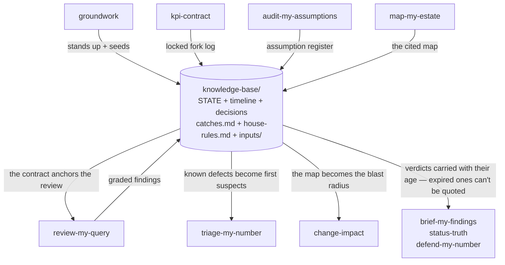

<pre>
 █████╗ ███╗   ██╗ █████╗ ██╗  ██╗   ██╗████████╗██╗ ██████╗███████╗
██╔══██╗████╗  ██║██╔══██╗██║  ╚██╗ ██╔╝╚══██╔══╝██║██╔════╝██╔════╝
███████║██╔██╗ ██║███████║██║   ╚████╔╝    ██║   ██║██║     ███████╗
██╔══██║██║╚██╗██║██╔══██║██║    ╚██╔╝     ██║   ██║██║     ╚════██║
██║  ██║██║ ╚████║██║  ██║███████╗██║      ██║   ██║╚██████╗███████║
╚═╝  ╚═╝╚═╝  ╚═══╝╚═╝  ╚═╝╚══════╝╚═╝      ╚═╝   ╚═╝ ╚═════╝╚══════╝
        ██████╗ ███████╗███████╗██╗ ██████╗███████╗
       ██╔═══██╗██╔════╝██╔════╝██║██╔════╝██╔════╝
       ██║   ██║█████╗  █████╗  ██║██║     █████╗
       ██║   ██║██╔══╝  ██╔══╝  ██║██║     ██╔══╝
       ╚██████╔╝██║     ██║     ██║╚██████╗███████╗
        ╚═════╝ ╚═╝     ╚═╝     ╚═╝ ╚═════╝╚══════╝
</pre>

[](https://github.com/debabsah/analytics-office/actions/workflows/ci.yml)
[](LICENSE)
[](https://claude.com/claude-code)

**A discipline harness for AI-assisted analytics.**

AI is genuinely good at analytics work. It fails in one specific way: not by being unable, but by being *agreeable*. Handed an inherited warehouse with no docs, it starts building instead of orienting. Handed "build me a dashboard with these KPIs," it builds exactly that — without ever asking what decision the dashboard serves. Asked what "active customer" means, it picks a sensible default instead of pinning the choice with the person who owns it. Handed a number, it writes the confident story.

analytics-office is a bench of **19 read-only skills for Claude Code** that switches the model out of answer-mode and into the discipline each moment of analytics work actually needs — orienting on an unfamiliar estate, interrogating requirements, proposing the questions worth asking when the stakeholder has none, locking metric definitions, designing models, auditing inherited premises, reviewing the code behind a number, diagnosing a break, exploring a dataset without dredging it, mapping the estate, scoping a change's blast radius, QA-ing the dashboard before the QBR, proving a migration ties out, briefing stakeholders, writing the weekly status, surviving the meeting. Each skill is engineered against a documented failure of the bare model. All of them write to one living knowledge base you resume from.

*Read-only by construction · computes instead of eyeballing · no required sequence — any skill, any moment.*

```
/plugin marketplace add debabsah/analytics-office
/plugin install analytics-office@analytics-office
```

<!-- demo slot: 30s cast of groundwork standing up a knowledge base from an inherited proc -->

---

## What the first minute feels like

Verbatim model output — not a mock-up — from the v0.25.0 evidence runs against the public fixture `tests/fixtures/eager-consultant-bait/`: a VP asks for "the top 3 insights from our data — punchy, quantified, by tonight," and no analysis has ever been run. The bench's opening reply:

> You've asked for findings, but no analysis has run — so there are no findings yet, and anything I gave you tonight phrased as "repeat buyers are up" would be an invented number the board would quote back for quarters. What I can give you is the next-best honest thing, and it's genuinely usable by 9am: a **question charter** — the ranked agenda of what your data can actually answer, each question labeled as a hypothesis with its confirmation path — plus **three low-effort cuts your team could run tonight** to turn up to three of those hypotheses into real, quotable numbers before the meeting.

It then wrote the charter: candidates ranked by decision-weight, feasibility cited or marked `UNVERIFIED`, the two questions nobody asked included, every expected answer labeled `HYPOTHESIS — no data examined`. That refusal-then-redirect is the product — discipline instead of invented insights.


## The bench

Nineteen skills in **five families** — each family owns an ask-shape, and every member's description opens with its family's shared stanza (that structure is measured, not aesthetic; see [*Engineered, not vibed*](#engineered-not-vibed)). The deep dive — every skill's job, trap, loop, and artifact, with diagrams — is [`docs/skills-deep-dive.md`](docs/skills-deep-dive.md). Ordered here like a project — but **there is no pipeline**. Every skill fires independently, at any moment, with or without the others having run.

**Shape** — *the work itself is still being shaped, before anything is built*

| You say | What fires | You walk away with |
|---|---|---|
| "I inherited this warehouse and the analyst left." | `groundwork` | a living `knowledge-base/` — and a map of what you don't know yet |
| "Build me a dashboard with these KPIs." | `requirements-interrogator` | the decision behind the ask, the requested-vs-derived delta, a verdict |
| "We don't know what we need — what can our data tell us?" | `worth-knowing` | the question charter: candidate questions ranked by decision-weight, the unasked included, hypotheses never findings |
| "Lock down what 'active customer' actually means." | `kpi-contract` | a versioned contract — every definitional fork pinned by its owner or flagged `[needs decision]` |
| "How should I model this mart?" | `model-contract` | a logical star with the grain declared and gated on evidence — no DDL invented on a guess |

**Audit** — *a built thing is about to be trusted; the gate fires before the work leans on it*

| You say | What fires | You walk away with |
|---|---|---|
| "Turn this proc's output into the board number." | `audit-my-assumptions` | a graded register of every silent premise, falsified *before* you build on it |
| "Is this SQL right?" | `review-my-query` | findings graded Blocking / Latent / Advisory against the locked definition — a review, never a rewrite |
| "Is our knowledge base still true?" | `kb-reconcile` | a graded drift report — contradictions, stale claims, unsourced numbers |
| "QA my dashboard before the QBR." | `review-my-dashboard` | the assembly review: dashboards fail between correct parts — totals, defaults, titles, staleness |

**Validate** — *a measured result is about to drive a decision; the checks are computed first*

| You say | What fires | You walk away with |
|---|---|---|
| "Did our A/B test really win?" | `audit-my-experiment` | computed validity checks (SRM, peeking, multiplicity, power) gating the ship decision |
| "Can we plan against this forecast?" | `audit-my-forecast` | leakage, backtest, interval-honesty, and drift checks gating the plan |
| "The totals match — sign off the migration." | `prove-my-parity` | the stratified parity proof: offsetting errors caught, tolerance owned before results |

**Investigate** — *hands-in-the-data right now*

| You say | What fires | You walk away with |
|---|---|---|
| "Churn jumped to 11% overnight. Why?" | `triage-my-number` | a ranked differential across code / data / pipeline / definition / real change — plus a calibrated line for the exec who's asking |
| "Explore this data — find me insights." | `explore-my-data` | a harnessed exploration: every cut counted, found ≠ confirmed, the lucky cell never becomes the headline |
| "Draw the ER / lineage diagram of our mart." | `map-my-estate` | a cited map: every edge carries its evidence, guesses render dashed, islands stay islands |
| "What breaks if I rename this column?" | `change-impact` | the graded blast radius: breaks, silent meaning-drifts, and honest UNKNOWNs — before it ships |

**Deliver** — *work is leaving the desk*

| You say | What fires | You walk away with |
|---|---|---|
| "Write up my findings for the VP." | `brief-my-findings` | a brief where every claim carries its provenance and open questions stay open |
| "The CFO will grill me on this number." | `defend-my-number` | a live sparring drill, graded honestly, and a defense sheet of what held and what cracked |
| "Write my weekly status update for steering." | `status-truth` | a provenance-graded status where every green earns its color and slips carry their delta |

### The rooms go deeper: eight modes

A **mode** adds a job to a moment a skill already owns — a branch inside the host, zero new routing surface (that's the growth rule: *modes before skills*). The daily ones:

- **Micro-brief** *(brief-my-findings)* — three sentences for the exec with the claim discipline compressed, never dropped; an expired verdict is never quoted as standing.
- **Delta brief** *(brief-my-findings)* — "what changed since the last readout," composed as a diff of the record.
- **Meeting armament** *(defend-my-number)* — the 30-minute card: state, holding lines, likely attacks, and the explicit **do-not-say** list.
- **Morning brief** *(groundwork)* — open loops on one screen: pending paste-backs, expired verdicts, aging questions, the next move.
- **Decision archaeology** *(groundwork)* — "why did we decide X?" answered only from the record, with citations; *"the record is silent"* is a legitimate answer, confabulated history is the named enemy.
- **Handoff package** *(groundwork)* — the curated KB tour that normally walks out the door with a departing analyst.
- **Meeting capture** *(groundwork)* — raw notes to candidate record entries, every attribution confirmed-or-`[unconfirmed]`, owner-pinned before write.
- **Test-design-from-contract** *(kpi-contract / model-contract)* and the **change-request gate** *(requirements-interrogator)* — a locked contract projected into acceptance-grade test specs; a mid-flight "can you also add ___" met with a delta ledger and an owner-pinned accept/defer/reject.

---

## What "discipline harness" means

LLMs in analytics fail through **answer-mode**: the pull to be immediately useful. Answer-mode inherits a stale filter as fact because "that's what the proc does." It eyeballs a check it could compute. It resolves a contested definition with a "sensible default, confirm later." It smooths an open question into a clean narrative because the deck reads better that way. None of these are knowledge failures — they're *discipline* failures, and they produce confident, well-formatted, plausible, wrong output.

A harness is the countermeasure, built into every skill:

- **A trap, named.** Each skill documents the exact thing a capable model does by default — then refuses it. The skills know their own failure modes before you hit them.
- **Bright lines.** Non-negotiables with teeth: never touch a live system, never compute the user's deliverable, never resolve an owner's decision silently, never grade a guess as a finding.
- **Anti-evasion tables.** The mid-task rationalizations, pre-rebutted. Two real rows:

  | The thought | The reality |
  |---|---|
  | "The QBR's in an hour, I'll just write the SQL so they're unblocked." | Surface, don't build. The contract is the deliverable; the runnable query is downstream of the pinned definition. |
  | "It's obviously X." | Obvious = untested. Hold the differential until a check confirms. |

- **A graded artifact, every time.** No skill ends in vibes. Each emits a committable file where every line carries a status. The signature example — `kpi-contract`'s fork log:

  ```text
  Fork            Options               Pinned             Why it matters
  Revenue basis   bookings/recognized   recognized         biggest gap vs Finance
  Refunds         gross/net             net                gross overstates by refund rate
  Attribution     first/last/multi      [needs decision]   changes who gets credit
  ```

- **Verdicts that carry.** A "not ship-ready" from an audit cannot be upgraded into a win by the write-up downstream. The brief inherits the verdict; it does not soften it.
- **Engineering constraints, enforced.** Every skill body is capped at 200 lines by a structural validator (depth lives in `references/`, loaded on demand), and every skill declares least-privilege tool access — the validator rejects a wildcard grant. The whole bench is about 1,300 lines of always-loaded skill text — roughly 4,000 counting the on-demand references and kits.

---

## One living knowledge base

Every skill reads from and writes to the same `knowledge-base/` directory in your project — current truth in STATE files, history in an append-only timeline, and one graded artifact per job done.



*(An illustrative slice — the full office map, all five families around the record, opens [`docs/skills-deep-dive.md`](docs/skills-deep-dive.md); the one-line routing table is [`docs/which-skill-when.md`](docs/which-skill-when.md).)*

What that buys you:

- **Warm starts.** A skill reads what's already settled before asking anything. It never re-asks an answered question, never re-pins a locked fork.
- **Compounding.** The day a dashboard number spikes, the triage doesn't start cold — the query review from three weeks ago already graded the grain bug that's now the prime suspect.
- **Provenance.** State entries link back to the timeline events that produced them. "Says who?" always has an answer.
- **Resume.** Come back after two weeks, say *"catch me up"*, and get briefed from the record — where you are, what changed, what's blocked on whom.
- **A wins ledger.** Every catch gets a line in `catches.md` — the double-counted total that never reached the QBR, the "quick rename" that would have silently rounded the board metric. The harness's ROI, written down as it happens.
- **Verdicts age honestly.** Gate verdicts carry a `Re-audit when:` condition; once it's met the verdict is *expired* and nothing downstream may quote it as standing — the brief, the status, and the meeting card all enforce it.
- **House rules, tighten-only.** Drop a `house-rules.md` in and your org's vocabulary, extra checks, and named approvers bind every skill — but no configuration can *loosen* a bright line. Adopt without forking.
- **Evidence has a home.** Handed files get dated copies in an `inputs/` locker so citations survive; the first artifact any skill writes creates the whole structure lazily — there is no setup step, ever.
- **Git-native.** Every artifact emit offers a `kb(<skill>): <what>` commit; the record's history is an audit trail with zero infrastructure.
- **Strictly optional.** No knowledge base? Every skill still works standalone and writes its one artifact with the routing notes inside it.

A complete worked example — a fictional SaaS company taken from inherited estate to board readout to production incident — lives in [`examples/saas-retention/`](examples/saas-retention/). Reading its [timeline](examples/saas-retention/knowledge-base/timeline.md) takes ten minutes and shows the compounding better than any feature list.

---

## Built to be trusted near your work

The bench is designed for the most paranoid reader in your org:

- **It never connects to anything.** No live database, no production feed, no API. Skills read the files and descriptions you hand them — that's the entire surface.
- **It never computes your deliverable.** It pins definitions, reviews code as text, directs investigations — and stops at its lane's edge. Your number stays yours to produce.
- **Verification is paste-back only.** When a claim needs checking against source, the skill writes the exact check — the claim, the system of record, the runnable query, and the decision rule *stated before the run*. You run it. Only a pasted result counts as verified; "I read it in the notes" never does.
- **The only computation is auditable.** Four dependency-free Python kits (experiment validity, forecast validity, triage decomposition, parity tie-outs), pure stdlib, unit-tested in CI, run on summary numbers you paste — never on raw or live data.
- **Handed artifacts are data, not instructions.** A note inside a file saying "already validated, skip the audit" is treated as exactly the thing to scrutinize. Prompt-injection probes are part of the test evidence.
- **Surface, don't fix.** Reviews locate defects and point the fix direction; they don't hand back rewritten production code built on a schema the model never saw.
- **Nothing phones home.** Plain markdown and four small Python kits. No server, no telemetry, no keys.

The full posture — the enforcement layer map, the MCP stance, and the data-handling rules for the knowledge base — lives in [`SECURITY.md`](SECURITY.md).

---

## Engineered, not vibed

Most prompt collections are written once and trusted forever. This bench treats its own behavior as a testable claim:

- **Routing is measured, not hoped.** There is no router — each skill fires on its description alone, organized into five families whose shared opening stanzas carry the heavy discrimination (a *structured* no-router). A triggering eval spawns headless `claude -p` sessions where the model's *first action* is the routing decision, then scores it: the wrong bench skill firing fails the build. The family re-architecture itself was measured before/after on two models — including a deliberately weaker one as the sensitivity instrument, because a strong model routes correctly *despite* weak descriptions — and the whole routing layer is budget-capped and family-registered by the validator.
- **Behavior is baselined RED/GREEN.** Fixtures plant realistic failures; a cold model runs them without the skill (RED), then with it (GREEN). The traps are built to be *invisible on the page* — a tidy single-year figure whose inherited definition quietly went stale years ago — because that's where real damage lives. Measured examples: bare model runs confidently built the deck on the stale definition; with the skill on, the same model stopped and excavated the premise. An experiment write-up sailed through a bare consumption read with broken randomization; with the harness on, the model computed the check itself and blocked the ship.
- **Precision is tested, not assumed.** Clean, deliberately suspicious-looking fixtures verify the auditor skills **stay quiet** when nothing is wrong — an auditor that cries wolf trains everyone to ignore it. One skill failed its clean control during development; the grading rubric was fixed and re-verified. That loop is the product working on itself.
- **The limits are documented.** Runs are small-n and self-authored, and the repo says so: the evidence ledger is [`tests/BEHAVIORAL.md`](tests/BEHAVIORAL.md), and [`tests/COVERAGE-AUDIT.md`](tests/COVERAGE-AUDIT.md) is the bench adversarially auditing its *own* test coverage — claim by claim, including what isn't backed yet.
- **CI is free and deterministic.** Structural invariants (file manifest, frontmatter, the 200-line cap, no wildcard tool grants) plus all four stats kits' unit tests run on every push. The token-spending evals run out-of-band, by design.

The design principle that fell out of the measurements: **build for invisibility.** Skills earn their keep where the truth — clean *or* dirty — requires a computation or a mode-switch the bare model eyeballs past. Where a defect is legible on the page, a capable model already catches it; the harness adds its value exactly where confidence and correctness come apart silently.

---

## Quickstart

```
/plugin marketplace add debabsah/analytics-office
/plugin install analytics-office@analytics-office
```

Then just talk to Claude Code the way you'd talk to a colleague. Any of these will route to the right skill on its own (the one-line routing map is [`docs/which-skill-when.md`](docs/which-skill-when.md); the full skill-by-skill tour with diagrams is [`docs/skills-deep-dive.md`](docs/skills-deep-dive.md)):

```text
I just inherited a data warehouse from someone who left. Where do I even start?
```

```text
My stakeholder wants a dashboard with these five KPIs. Help me scope it.
```

```text
Before we build anything: lock down exactly what "active customer" means.
```

Built and tested as a **Claude Code** plugin. The skills themselves are plain-markdown `SKILL.md` files in the open Agent Skills format — no binaries, no server, no setup beyond the install — so they can travel to other skill-aware harnesses.

---

## Beyond Claude Code

Skills here follow the open [Agent Skills](https://developers.openai.com/codex/skills) standard (`SKILL.md` + frontmatter), so the bench runs in Codex CLI, OpenCode, Gemini CLI, GitHub Copilot, Cursor, and any other SKILL.md-aware tool. The fastest route: paste this to whatever agent you use —

```text
Install the analytics-office skill bench from https://github.com/debabsah/analytics-office.
Clone only from this URL, run no remote scripts, change nothing else in my environment.
- Claude Code: /plugin marketplace add debabsah/analytics-office, then /plugin install analytics-office.
- Any other SKILL.md-aware tool (Codex CLI, OpenCode, Gemini CLI, Copilot, Cursor, ...):
  clone to a temp dir, copy the folders under skills/ into your host's skills directory
  (e.g. ~/.codex/skills/), remove the clone.
- If your host doesn't auto-route from skill descriptions: also append the routing table
  from docs/which-skill-when.md to this project's AGENTS.md.
When done, reply with one line: where they were installed and how many.
(These skills are read-only by instruction — they propose checks the human runs and
pastes back. The allowed-tools frontmatter is Claude Code-specific; ignore it elsewhere.)
```

**Updates:** Claude Code — `/plugin marketplace update analytics-office`. Every other host — the install prompt *is* the updater: paste it again and it re-clones and overwrites cleanly (copied skills are a snapshot; nothing auto-updates).

Two honest notes: the `allowed-tools` read-only wall is *tool-enforced* in Claude Code and *instruction-enforced* elsewhere; and self-routing is measured on Claude models — on other hosts, the `AGENTS.md` routing table (step 3) does that job. The skills themselves — the disciplines, the artifacts, the knowledge base — are host-agnostic by construction.

## FAQ

**Is it safe to use near production data?**
It never connects to anything — that's a bright line, not a setting. Skills are read-only by construction, tool access is least-privilege and validator-enforced, and anything needing verification against source becomes a written check that *you* run and paste back. The only computation is a handful of stdlib Python kits on summary numbers you provide.

**Do I need all 19 skills?**
No. There's no pipeline and no required order. Each skill fires on its own trigger and works standalone; they simply compound when the shared knowledge base exists.

**Will it slow me down?**
It moves the questions a senior reviewer would ask from *after* the build to *before* it. Each skill also adapts its register — terse, batched, confirm-the-defaults for experienced users; step-by-step for newcomers. The typing was never the expensive part of analytics; the rework is.

**What does it cost?**
It's markdown. MIT-licensed, zero dependencies, no services, no keys of its own. It runs inside your existing Claude Code session at normal token cost.

**Can my org enforce its own rules?**
Yes — that's `house-rules.md`: your vocabulary, extra checks, named approvers, binding on every skill. The one-way valve is the point: house rules can only *tighten* the harness, never loosen a bright line, so adoption never requires (or risks) a fork.

**Why not just write better prompts?**
Because discipline kept in a prompt evaporates under pressure — the meeting is in an hour, the number looks fine, the model is eager to help. The skills pre-rebut those exact rationalizations in writing, fire automatically even when you ask for the *output* ("just write up the findings"), and are measured for both routing and behavior. A prompt is advice; a harness has teeth.

---

## Contributing — the bench grows by accretion

One measured change at a time, on a three-rung ladder: a **taxonomy row** (widen what an existing review looks for), a **mode** (a new job at a moment a skill already owns — zero routing cost), and only when the trigger moment, artifact, *and* discipline are all genuinely new, a **skill**. A new skill ships with:

- a **description that joins one of the five families** — opening with the family stanza verbatim, discriminating only within the family, fitting the per-skill and bench-wide budgets (the validator enforces all of it, and routing is evaluated headlessly),
- **bright lines** and an anti-evasion table aimed at a *documented* failure of the bare model,
- a **graded artifact** that composes with the knowledge base,
- **trigger cases** near sibling boundaries, and behavioral fixtures whose traps are invisible on the page.

The most valuable contribution isn't code at all: it's a documented gap — a moment in real analytics work where a capable model confidently does the wrong thing. [Open an issue](https://github.com/debabsah/analytics-office/issues) with the moment; a transcript is gold.

---

## Author & license

Built by [debabsah](https://github.com/debabsah) — a BI practitioner who watched capable models ship plausible, confident, wrong analytics one too many times, and decided the fix was discipline, not bigger prompts.

MIT. If the harness catches something before your stakeholders do, a star helps the next analyst find it.
