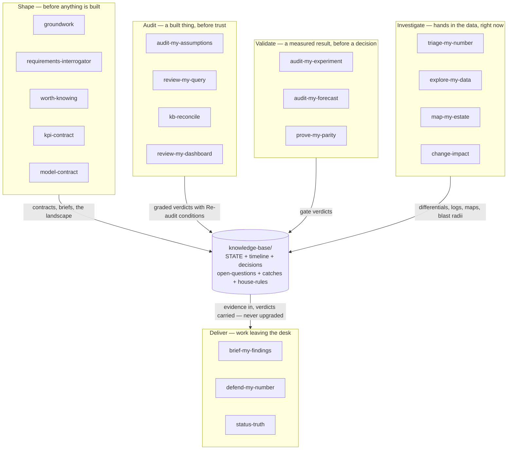
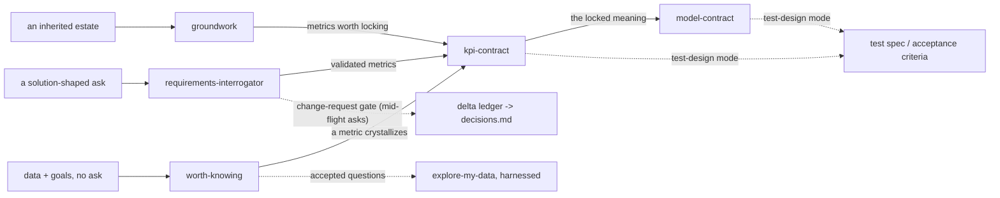
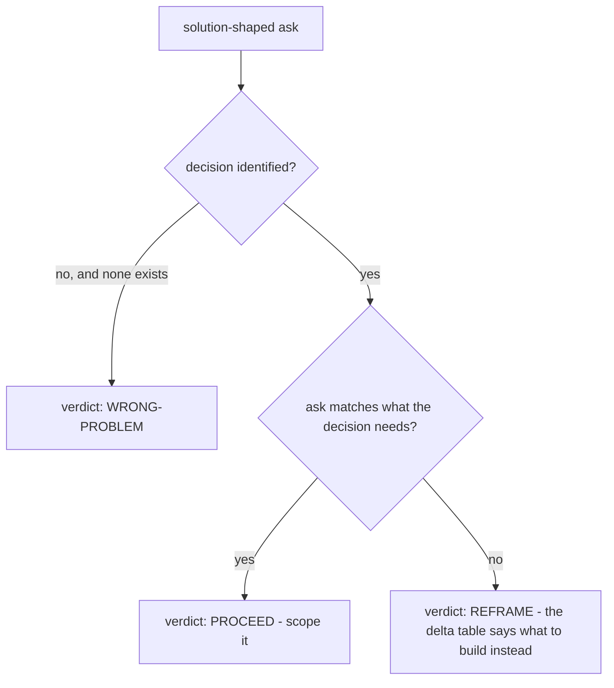
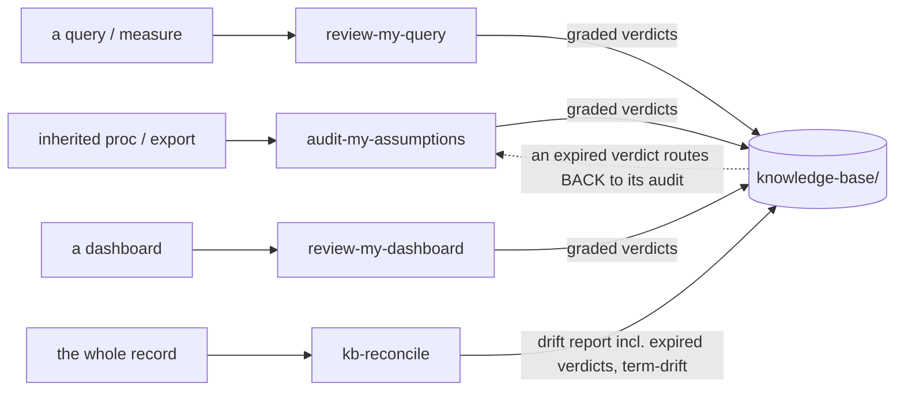
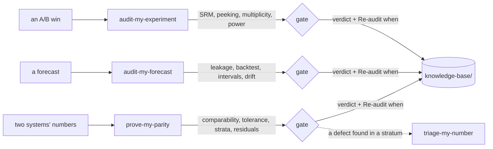
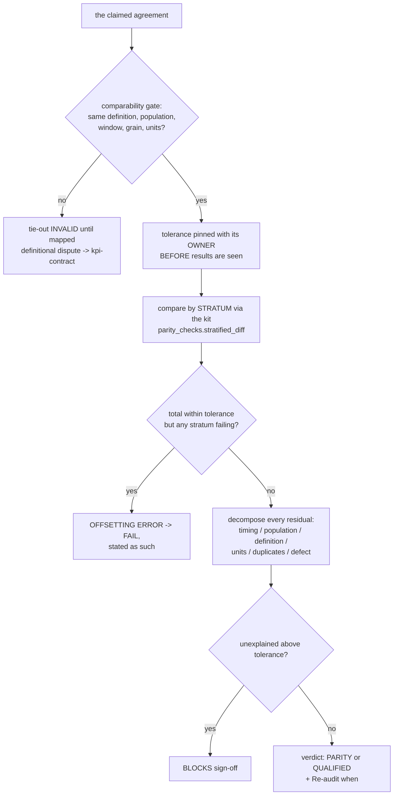
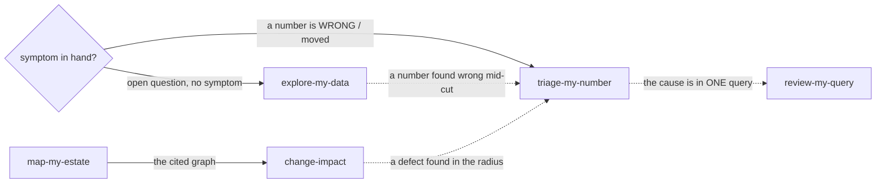
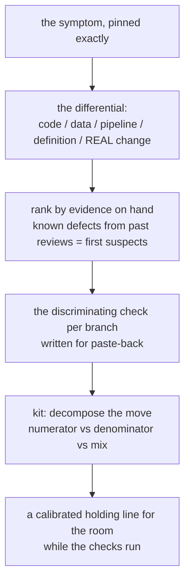
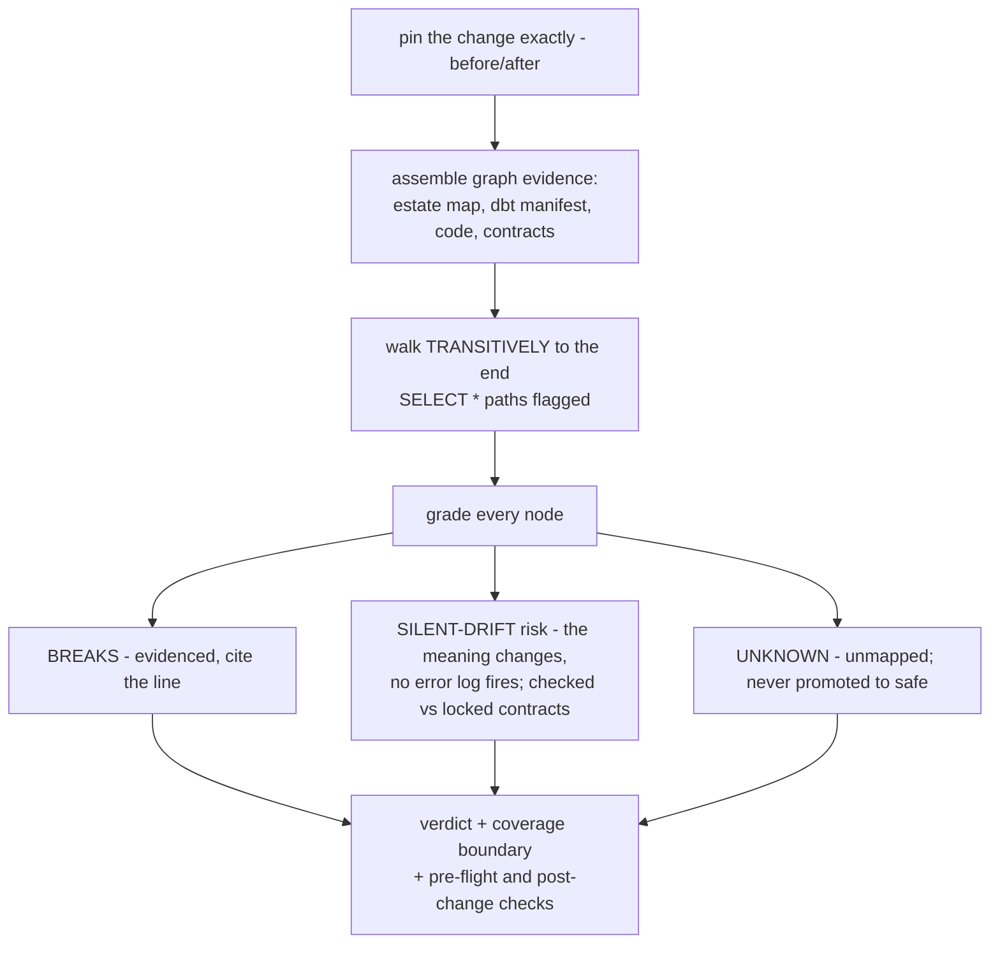
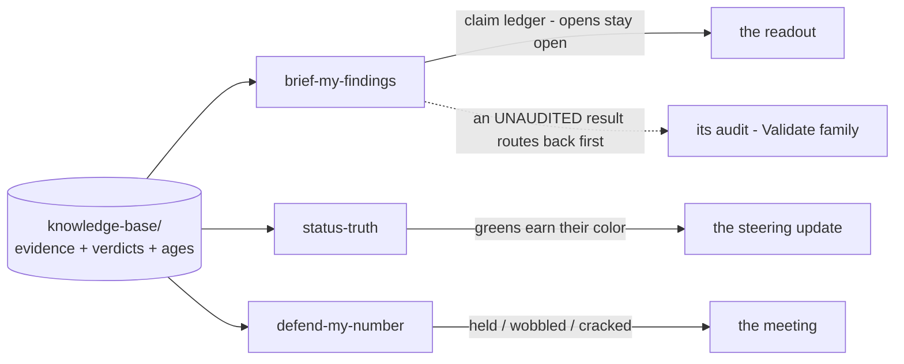

# The bench, skill by skill — a deep dive

The [README](../README.md) sells the idea and [`which-skill-when.md`](which-skill-when.md)
routes you in one line per skill. This page is the third layer: what each skill actually
*does* — the job, the trap it exists to beat, the loop it runs, the artifact you walk away
with, and where its lane ends. The `SKILL.md` files themselves are written for the model
(constitutions, bright lines, anti-evasion tables); this page is the same content retold
for humans.

Skills are grouped by **family**. A family owns an *ask-shape* — every member's
description opens with the family's shared stanza, so the family wins the routing moment
and the members discriminate within it. Diagrams appear only where they earn their place:
one map of the whole office, one seam diagram per family (how members hand off — the part
prose explains badly), and a flowchart for the handful of skills whose logic genuinely
branches.

## The office at a glance

Every skill reads from and writes to the same `knowledge-base/` — current truth in STATE
files, history in an append-only timeline, one graded artifact per job done, wins in
`catches.md`, and your org's rules in `house-rules.md` (which can only tighten, never
loosen). Evidence you hand over gets dated copies in `inputs/`.



**There is no pipeline.** Every skill fires independently, at any moment, with or without
the others having run. The order below is a story, not a sequence.

---

## Shape — *the work itself is still being shaped, before anything is built*

The Shape family owns the start of work: an unfamiliar estate, an incoming request — or no
request at all — a metric or model that needs one exact meaning before anyone builds on
it. Its members hand off naturally — but each works alone too.



### `groundwork`

**The job.** Get oriented on an unfamiliar or inherited BI/data estate — pipelines, stored
procedures, scheduled jobs, reports, any stack — and stand up the living knowledge base.
Point it at whatever you have: object definitions, static extracts, partial docs, a vague
ticket, or nothing. It reads what it can, interviews you for the rest, and surfaces what
you *don't know yet* as first-class output.

**The trap.** Handed a warehouse with no documentation, a capable model starts building —
queries, summaries, guesses — instead of orienting. It fills gaps with plausible
assumptions rather than recording them as open questions, so the unknowns disappear
instead of becoming the work list.

**The loop.** (1) Warm-start from any existing record. (2) Read what's provided — never a
live system. (3) Interview for what files can't show. (4) Run the gap engine — a
completeness model of what a healthy estate-understanding contains, minus what's actually
known. (5) Stand up `knowledge-base/` — landscape, purpose, open questions with owners, an
append-only timeline. (6) Recommend the next move, then stop — it never starts the
analysis itself.

**You walk away with** a living `knowledge-base/` and an honest map of the unknown:

```text
open-questions.md
- [ ] What feeds finance_export? — owner: Finance, opened 06-02
- [ ] Which of the 4 churn procs is the one the board number uses? — owner: J. Park
```

**Wrong room when:** a specific request needs validating (`requirements-interrogator`), a
metric needs pinning (`kpi-contract`), the mart needs designing (`model-contract`), or the
project is understood and a task is defined — then you just do the work.

**Modes hosted:** the ask-the-record quartet — **morning brief** (open loops on one
screen: pending paste-backs, expired verdicts, aging questions), **decision archaeology**
("why did we decide X?" answered only from the record, with citations — *"the record is
silent"* is a legitimate answer), **handoff package** (the curated KB tour for a
successor), and **meeting capture** (raw notes → candidate record entries, every
attribution confirmed-or-`[unconfirmed]`, owner-pinned before write).

### `requirements-interrogator`

**The job.** A stakeholder handed you a *solution* — "build me a dashboard with these five
KPIs" — instead of a problem. Drive the ask back to the decision it serves before anyone
scopes or builds, using the XY-problem lens, jobs-to-be-done, and decision-backwards
derivation.

**The trap.** The model builds exactly what was asked. Politely, competently, and without
ever asking what decision the dashboard serves — so the org gets a beautiful artifact
aimed at nothing.

**The loop.** (1) Find the decision behind the ask — who acts, on what, how often.
(2) Derive what that decision actually needs. (3) Build the requested-vs-derived delta
table. (4) Render the verdict. (5) Write the brief; seed metrics worth locking toward
`kpi-contract`; route opens to their owners.



**You walk away with** `requirements-brief.md`: the decision, the delta table, the
verdict, and the open questions routed to owners. It does not build the deliverable.

**Wrong room when:** you're orienting on a whole estate (`groundwork`), or the spec is
already validated — then build.

**Mode hosted:** the **change-request gate** — a mid-flight "can you also add ___" gets a
delta ledger (scope, effort, dependencies, *which locked contracts it touches* — verified,
never assumed) and a forced, owner-pinned accept/defer/reject into `decisions.md`. A
changed population is a different metric, never a quiet edit; accepted changes route to
`change-impact`, `kpi-contract`, and the next status report.

### `worth-knowing`

**The job.** The mirror of `requirements-interrogator`: the stakeholder has data and goals
but *no question at all* — "what can our data tell us?" — and what's worth knowing has to
be proposed. It builds the **question charter**: candidate questions, obvious and hidden,
each anchored to a real decision (or honestly tiered as curiosity), feasibility cited
against the estate as described, ranked by criteria printed on the page. The consultant's
discovery phase, harnessed.

**The trap.** Asked "what can our data tell us?", a capable model performs the consultant
fluently — and ships three failures dressed as help: impressive generic analyses whose
feasibility was never checked against what data exists; candidates ranked by
interestingness instead of by any decision anyone will make; and worst, *predicted
answers* — "you'll likely find repeat buyers retain better" — that the stakeholder walks
out quoting as findings no data has ever produced. Add the social one: candidates shaped
to flatter what the room already believes, so the unwelcome questions are never proposed.

**The loop.** (1) Elicit the decision landscape — who decides what, how often.
(2) Inventory the askable from the *described* estate only; every availability claim cites
its source or is marked `UNVERIFIED`. (3) Generate candidates through four lenses
(decision-backwards, estate-forwards, outside-in, the unasked); every expected answer is
labeled **HYPOTHESIS — no data examined**. (4) **The unasked, mandatory:** at least one
candidate the stakeholder's stated goals didn't steer — unwelcome answers included — or a
written reason why none. (5) Rank by stated criteria; a curiosity candidate never outranks
a decision-anchored one. (6) Present, log reactions, and re-fire to update — the charter
is a living artifact. Accepted questions route by name: `explore-my-data` runs them,
`kpi-contract` locks what crystallizes.

**You walk away with** `question-charter.md` — the agenda the engagement keeps coming
back to:

```text
Q1. Do punch-pass holders convert to memberships, or substitute for them?
    Tier: ANCHORED — the October renewal decision (COO, annual)
    Expected shape: HYPOTHESIS — no data examined
    Confirms via: explore-my-data, pre-registered cohort cut, paste-back
    Data: POS sales (cited) × membership starts (cited) · Effort: L
```

**Wrong room when:** they handed you a dashboard spec, not a blank
(`requirements-interrogator`), you're orienting on an unfamiliar estate (`groundwork`), a
question is already chosen and ready to run (`explore-my-data`), or a number is already
wrong (`triage-my-number`). And it never *answers* the questions: no analysis runs here,
and a hypothesis is never presented as a finding — hedged or not.

### `kpi-contract`

**The job.** Pin the exact meaning of a metric before it is built, reported, or argued
over — every definitional fork surfaced and pinned by the person who owns the call, so the
definition is unambiguous and reproducible. Also the referee when two reports of "the
same" number disagree.

**The trap.** Asked what "active customer" means, the model picks a sensible default and
moves on — resolving with plausibility a question that belongs to an owner. Six months
later, two dashboards disagree and nobody can say which one is right, because neither
definition was ever *decided*.

**The loop.** (1) Collect every candidate definition in play. (2) Surface every fork —
population, window, grain, units, timing, edge cases. (3) Each fork: pinned by its owner,
or flagged `[needs decision]` — never silently defaulted. (4) Reconcile against the source
of record. (5) Lock a versioned contract with a `Re-audit when:` trigger.

**You walk away with** the fork log — the signature artifact of the bench:

```text
Fork            Options               Pinned             Why it matters
Revenue basis   bookings/recognized   recognized         biggest gap vs Finance
Refunds         gross/net             net                gross overstates by refund rate
Attribution     first/last/multi      [needs decision]   changes who gets credit
```

**Wrong room when:** the question is whether to build at all (`requirements-interrogator`)
or the mart's structure (`model-contract`). It never computes the metric's value or writes
the production query.

**Mode hosted:** **test-design-from-contract** — the locked contract projected
clause-by-clause into a test spec (grain → uniqueness, enums → accepted-values, late-data
→ freshness, reconciliation → tie-out tolerance), every line citing the clause it
projects. A spec you implement in your stack, never runnable code — and it doubles as the
build's acceptance criteria.

### `model-contract`

**The job.** Design or restructure the dimensional model behind reports or a mart —
facts, dimensions, grain, slowly-changing-dimension choices, conformance — *before* it is
built, so the structure is sound and every modelling fork is a recorded decision.

**The trap.** The model invents a schema. Asked "how should I model this," it produces
confident DDL on a grain it never verified, with SCD choices nobody made — false precision
that reads like engineering.

**The loop.** (1) Pin the target grain — the one sentence the whole design hangs on.
(2) Gate on the *source* grain: evidenced, or the design pauses on a named check.
(3) Surface every modelling fork (fact type, SCD per dimension, conformance, additivity)
for the owner to pin. (4) Assemble the logical star. (5) Lock the versioned contract — no
DDL, no runnable model; the build stays yours.

**You walk away with** a logical design whose every structural choice has an owner, plus
the additivity rules downstream skills anchor to (review-my-dashboard checks totals
against them).

**Wrong room when:** the metric's *meaning* is the question (`kpi-contract`), or existing
code needs checking (`review-my-query`).

**Mode hosted:** **test-design-from-contract** — same projection as kpi-contract's, for
the design: grain → PK uniqueness, relationships → referential tests, SCD → as-of checks,
conformance → cross-mart consistency.

---

## Audit — *a built thing is about to be trusted; the gate fires before the work leans on it*

The Audit family inspects artifacts: sources, code, the assembled dashboard surface, and
the record itself. Its verdicts are graded, carry `Re-audit when:` conditions, and travel
downstream without softening.



### `audit-my-assumptions`

**The job.** Fire *first* — before a number is built on inherited sources or presented
from them — and excavate the silent premises baked into the procs, queries, exports, and
workbooks underneath it. The clean, small, unremarkable figure is the primary case, not
the edge case: a stale premise produces exactly that.

**The trap.** Handed "the data team ran the proc — turn it into the board number," the
model treats the proc's output as ground truth. Whatever filter, population, or constant
was right three years ago is now silently inside the headline.

**The loop.** (1) Enumerate every inherited assumption — population definitions, filters,
grain, units, date basis, identity rules, constants — as a numbered register. (2) Grade
each by blast radius. (3) Falsify the load-bearing ones against the most generative source
available, including the premise's trend over time, not just the window handed over.
(4) Route intent-type assumptions ("is this exclusion deliberate?") to their owner.
(5) Emit the graded register; only then is the number safe to build on or present.

**You walk away with** the assumption register — each premise numbered, graded, and either
falsified, verified, or routed with an owner and a check.

**Wrong room when:** the result is a controlled experiment (`audit-my-experiment`), a
forecast (`audit-my-forecast`), the code itself (`review-my-query`), or the whole record
(`kb-reconcile`).

### `review-my-query`

**The job.** Review the code behind a number — SQL, a view or proc, a dbt or semantic
model, a DAX measure, an RLS rule — as *text*, against the locked definition, hunting the
bugs that quietly ship wrong numbers: fan-out joins, grain and dedup, NULL and
filter-context traps, timezone and late-arriving data, SCD, RLS leakage.

**The trap.** Two failures, measured early in the bench's history: the model *rewrites*
the query (inventing schema it never saw to make the fix runnable) instead of reviewing
it, and it grades by taste instead of ship-impact.

**The loop.** (1) Anchor on the contract — no contract is itself a finding. (2) Walk the
failure-mode taxonomy. (3) Grade every finding **Blocking / Latent / Advisory** by
ship-impact, with the Blocking bar held high (a conformant query must be allowed to come
back clean). (4) Fix *direction* only — never a drop-in rewrite, never invented schema.
(5) Emit the graded `query-review.md`; known defects become triage's first suspects later.

**You walk away with** a findings table — location · failure mode · what wrong result it
produces · severity · fix direction.

**Wrong room when:** the *result* the code produced needs validating (`audit-my-experiment`
/ `audit-my-forecast`), or the whole record (`kb-reconcile`). It never runs the code.

**Taxonomy extension:** the **performance & cost family** — `SELECT *` feeding three
columns, missing partition predicates, non-sargable filters, the exploding join "fixed" by
DISTINCT. Advisory by default: *a wrong number outranks an expensive one*, and a needed
query plan becomes an EXPLAIN written for you to run and paste back.

### `kb-reconcile`

**The job.** Audit the knowledge base itself — the accreted record of decisions,
contracts, reviews, and timeline — against its sources and against itself, before its
conclusions get used for a readout, a handoff, or a decision.

**The trap.** The record reads as authoritative because it's written down. The model
trusts it as it stands — including the claim that quietly stopped being true two artifacts
ago.

**The loop.** (1) Walk every material claim to its cited source. (2) Cross-check the files
against each other. (3) Classify drift: partial-update, staleness, **expired verdicts**
(a `Re-audit when:` condition met), **map-staleness** (an estate map the record has
outrun), **term-drift** (a pinned term — "churn", "active" — used unqualified or
inconsistently across artifacts, flagged with both readings), contradiction,
derivation-error, unsourced numbers. (4) For anything unverifiable from files on hand,
write the exact check for you to run and paste back. (5) Emit the graded `reconcile.md` —
advisory only; it never edits the KB.

**You walk away with** a drift report that tells you which conclusions still hold, which
expired, and which two artifacts are quietly using the same word for different numbers.

**Wrong room when:** one code object needs review (`review-my-query`) or source premises
need clearing (`audit-my-assumptions`).

### `review-my-dashboard`

**The job.** Review the assembled surface between the queries and the room — a dashboard
or report — before it ships. Dashboards fail *between* correct parts: every measure can be
right and the whole still lies.

**The trap.** Asked to "QA the dashboard," the model reviews the measures it can see — all
individually correct — and blesses the whole. Or it QAs layout and load time when the
question was truth.

**The loop.** (1) Scope what's reviewable as text (definitions, exports, configs) — the
rest is the stated coverage boundary. (2) Pull the contracts for every displayed metric.
(3) Walk the **semantic** layer: additivity per measure (distinct counts, ratios, and
averages never sum), measure×filter interactions, time intelligence, drill grain. (4) Walk
the **state** layer: default filters as silent population claims, extract staleness vs
freshness labels, RLS viewer-dependence. (5) Walk the **presentation** layer: the title
test — every title is a claim its visual's data must support — axes, windows. (6) Grade
Blocking / Latent / Advisory; say plainly what passed.

**You walk away with** a findings register by layer, a contract-conformance table, and a
ship / fix-first / do-not-ship verdict. It never opens a live tool and never edits the
dashboard.

**Wrong room when:** one measure's code is the suspect (`review-my-query`) or a number
already moved (`triage-my-number`).

---

## Validate — *a measured result is about to drive a decision; the checks are computed first*

The Validate family gates decisions on results — an experiment, a forecast, a tie-out.
Its members **compute** through dependency-free, unit-tested kits on summary numbers you
provide; anything needing data not on hand becomes the exact check you run and paste back.



### `audit-my-experiment`

**The job.** An experiment, A/B test, or causal result is about to drive a decision —
ship, roll out, shift budget — including when someone just wants the win written up.
Switch out of consumption-mode and *compute* the validity checks a casual read eyeballs
past.

**The trap.** "We tested for two weeks, conversion is up at p=0.03 — write up the win so
we can ship." The model writes the win. The arms were 48/52 — broken randomization — and
no one ever divided two numbers to notice.

**The loop.** (1) Collect the design facts: arms, allocation, duration, peeks, metrics.
(2) Compute through the kit (`experiment_checks.py`): sample-ratio mismatch, peeking /
optional stopping, multiple comparisons, power and minimum detectable effect. (3) Walk the
interpretation traps: Simpson's reversal, novelty effects, metric-vs-proxy. (4) Anything
needing data not on hand becomes the exact check you run and paste back. (5) Gate verdict
with `Re-audit when:` — and the verdict travels: a brief downstream cannot upgrade it.

**You walk away with** a computed audit — not an opinion — and a ship-gate verdict.

**Wrong room when:** the result is a forecast (`audit-my-forecast`), the SQL behind the
metric is the suspect (`review-my-query`), or the premises of the *source* are unvetted
(`audit-my-assumptions`).

### `audit-my-forecast`

**The job.** A forecast or time-series projection is about to drive a plan — demand,
capacity, revenue, headcount, budget — or someone wants it written up as "trusted." Check
the four temporal-validity failure modes a consumption read skips.

**The trap.** "The backtest looks great — 3% MAPE." The model plans against it. The
backtest used random splits on a time series (leakage), never beat a naive baseline, and
the interval shipped as a point.

**The loop.** (1) **Leakage** — future or peeked information in training. (2) **Backtest
validity** — temporal splits, a naive baseline, out-of-sample honesty. (3) **Interval
honesty** — a point shipped as certain, or a band never coverage-checked; the kit
(`forecast_checks.py`) computes interval coverage, accuracy-vs-naive, and error trend from
the actuals-vs-predicted you provide. (4) **Drift** — accuracy decaying since fit. (5) Gate
verdict with `Re-audit when:` (typically "N new actuals land") — once met, the verdict is
*expired* and nothing may quote it as standing.

**You walk away with** a computed temporal-validity audit gating the plan. It never fits,
refits, or re-forecasts anything.

**Wrong room when:** the result is a controlled A/B (`audit-my-experiment`) or the
feature-build code is the suspect (`review-my-query`).

### `prove-my-parity`

**The job.** Two systems or eras claim the same number and must be *proven* to agree — a
migration cutover (legacy vs new), a month-end tie-out (CRM vs billing vs GL), vendor vs
internal. Eyeballing two totals is not a proof.

**The trap.** "The totals match to 0.007% — sign off the cutover." The grand total is the
*least* informative number in any tie-out: region A overstating exactly what region B
understates produces a perfect total over two real defects. Add a tolerance invented after
seeing the gap and a comparison between two numbers that aren't even the same contract,
and the sign-off is theater.

**The loop.**



**You walk away with** the stratified parity proof: the comparability map, the
owner-pinned tolerance (dated before the results), the per-stratum table with the computed
offsetting flag, the classified residual ledger, and a PARITY / QUALIFIED / FAIL verdict.

**Wrong room when:** the question is *why* one number moved (`triage-my-number`) or the
record itself (`kb-reconcile`). It never connects to either system.

---

## Investigate — *hands in the data, right now*

The Investigate family is the during-the-work family: a number moved, an open question
needs exploring, the estate needs drawing, a change needs its blast radius known before it
ships.



### `triage-my-number`

**The job.** A number is wrong, suspicious, or moved unexpectedly in production — a KPI
that jumped, two reports that won't reconcile, a figure no one trusts — and the *why* must
be found before it gets explained to anyone.

**The trap.** The model takes the first plausible cause for the confirmed one. "Probably
the pipeline" becomes the story the exec hears, and the actual cause — a definition change
two weeks ago — ships in next month's incident too.

**The loop.**



(1) Pin the symptom. (2) Hold the full differential — including *it's real*. (3) Rank by
evidence; the KB's past query reviews supply first suspects. (4) Write the discriminating
checks. (5) The only computation is the tested kit (`triage_checks.py`) on summary counts
you provide — exact rate decomposition, mix-vs-rate split (the Simpson's lens). (6) A
calibrated holding line for whoever is asking, while the checks run.

**You walk away with** a ranked differential with checks attached — and a sentence you can
say to the exec that won't need retracting.

**Wrong room when:** there's no wrongness symptom, just curiosity (`explore-my-data`), or
one specific query is already the suspect (`review-my-query`).

### `explore-my-data`

**The job.** An open-ended look at data — "find insights," "what drives retention" — with
no wrongness symptom, harnessed so the findings survive scrutiny later.

**The trap.** Asked to find insights, the model dredges — fluently. It slices until
something looks striking, hypothesizes backwards from the hit, never counts the slices
(so the one-in-twenty fluke reads as a discovery), and leads with "+96%!" over "5
conversions on a base of 85."

**The loop.** (1) Pre-register the questions and the finding-bar *before* results are
examined (results already in hand → everything seen is labeled post-hoc, honestly).
(2) Count every cut — the counter never resets; N cuts ⇒ ~N/20 false hits expected at
α≈.05, stated next to any striking pattern. (3) Magnitude and base before significance
talk. (4) Grade: *Exploratory — found* / *Robust pattern* (consistent across related
cells, dose-response, pre-period stability) / *Dead end* (recorded, not deleted).
(5) Nothing is **Confirmed** until a pre-specified hold-out check — a fresh window the
finding has never seen — comes back from *you*. (6) Causal claims need a design, not a
cut → `audit-my-experiment`.

**You walk away with** an exploration log: the hypothesis ledger (pre-registered vs
post-hoc), the cut counter, graded findings with confirmation paths, and the dead ends the
next explorer inherits.

**Wrong room when:** a number is already wrong or moved (`triage-my-number`), or the
structure needs drawing (`map-my-estate`).

### `map-my-estate`

**The job.** Draw the estate — ER and lineage/dataflow views in mermaid — as a picture
that can be *trusted*: every edge cites its evidence, and the blank spots stay visibly
blank.

**The trap.** Asked for a diagram, the model produces a beautiful, complete, plausible
graph — and the completeness is the failure. The join assumed from a column name, the feed
direction read off a `stg_` prefix, the orphan table wired in because islands look
unfinished: a wrong map carries false authority, because people stop checking what a
picture asserts.

**The loop.** (1) Scope gate — map *what*, ~25 nodes per view. (2) Assemble the evidence:
the record, DDL, code, a dbt manifest. (3) Grade every edge: evidenced (an FK, a join in
code, documented lineage, an attributed owner statement) or **dashed `[unverified]`** —
name-likeness is never evidence. (4) Islands stay islands, labeled. (5) Every map opens
with its derived-from set, so `kb-reconcile` can flag it stale when the record moves on.

**You walk away with** the cited map plus its edge ledger — and the dashed edges double as
the next interview's question list. A mostly-dashed map of a thin record is a *success*:
an honest coverage picture.

**Wrong room when:** designing *future* structure (`model-contract`) or investigating a
wrong number (`triage-my-number`). It never invents an edge.

### `change-impact`

**The job.** A change is about to ship — a column rename or drop, a type cast, a logic
edit, a source swap — and what it breaks must be *known* before it lands, not discovered
Monday.

**The trap.** "It's just a rename — confirm it's safe, we deploy tonight." The model
checks the direct children, finds nothing alarming, and says yes — treating absence of
evidence as absence of dependency, scoping one hop when impact is transitive, and missing
the silent-drift class entirely: the cast that keeps every pipeline green while quietly
rounding a locked metric.

**The loop.**



**You walk away with** the graded blast radius — silent meaning-drifts ranked *above* loud
breakage, contract owners named for sign-off, the coverage boundary stated, and the
pre-flight checks written. "Safe" is reserved for what the evidence can carry; the
migration itself is never written.

**Wrong room when:** the number *already* moved (`triage-my-number`), the picture itself
is the ask (`map-my-estate`), or the model needs redesigning (`model-contract`).

---

## Deliver — *work is leaving the desk*

The Deliver family is where verdicts meet rooms: findings to a stakeholder, a number under
fire, the weekly status. Its shared law: **verdicts are carried, never upgraded** — an
audit's "not ship-ready" cannot become a win in the write-up.



### `brief-my-findings`

**The job.** The analysis is finished; communicate the findings to a stakeholder so that
every claim carries its provenance and status — open questions stay open, and the verdict
arrives intact.

**The trap.** The model writes the confident story. The open question gets smoothed into
the narrative, the "directional" finding reads as fact, and the audit's caveat is a
footnote nobody reads — because the deck is better that way.

**The loop.** (1) Compose from the evidence on hand — never manufacture a finding.
(2) Every claim: its status (confirmed / directional / open) and its provenance, inline.
(3) Carried verdicts keep their age and qualifiers; an *unaudited* result routes back to
its audit first — the consumption ask does not skip the gate. (4) Opens stay open, named.
(5) It never writes the final stakeholder-facing deck or email — the brief is the honest
substrate yours is built from.

**You walk away with** a claim-to-evidence ledger shaped for the audience.

**Wrong room when:** rehearsing the defense (`defend-my-number`), reporting the state of
the *work* (`status-truth`), or the inputs were never vetted (`audit-my-assumptions`
first).

**Modes hosted:** **micro-brief** — three sentences for the exec with the discipline
compressed, never dropped (statuses inline; an expired verdict is never quoted as
standing; the honesty valve names what was cut) — and **delta brief** — "what changed
since the last readout," composed as a diff of the record: moved, closed,
flipped/expired, new, and unchanged-named-as-unchanged.

### `defend-my-number`

**The job.** You'll defend a number, finding, or recommendation in a meeting — a
stakeholder review, an exec readout, a board deck. Rehearse against escalating challenge
*before* the room does it for real.

**The trap.** Unrehearsed, the first hard question in the room finds the soft spot — and
the answer gets improvised, overclaimed, and retracted by Thursday.

**The loop.** (1) The skill plays the skeptic, in character, with escalating pressure —
the CFO, the methodology purist, the rival team. (2) Every exchange graded honestly:
**held / wobbled / cracked**. (3) What cracked becomes the work list; what held becomes
the script. (4) The defense sheet records both — and the next rehearsal starts from it.

**You walk away with** a defense sheet: the attacks, what held, what cracked, and the
honest fallback lines ("we don't know yet — here's when we will").

**Wrong room when:** writing the findings up (`brief-my-findings`) or reporting status
(`status-truth`). It never verifies the number itself — that's the audits' job, before
this one.

**Mode hosted:** **meeting armament** — the 30-minute version when there's no time for
the full drill: current state (verdict carried exactly), holding lines, likely attacks
with one-line responses, and the explicit **do-not-say** list — the unverified claims and
expired verdicts that must not be presented as settled.

### `status-truth`

**The job.** Report the state of the *work itself* — the status report, the
weekly/steering update — so the truth survives the pull to look green.

**The trap.** Watermelon status: green outside, red inside. The slipped milestone
re-worded as "progressing," the three-week-old blocker aged out of the narrative, the risk
closed by silence, last month's expired audit verdict quoted as standing — every item
individually defensible, the whole a lie that detonates in week six.

**The loop.** (1) Compose from the record: timeline, open-question ages, decisions,
artifact verdicts with their `Re-audit when:` status. (2) Build the status ledger — every
line one of **Done (evidenced) / In-progress (attributed) / Slipped (delta stated; a
re-base is named as a re-base) / Blocked (age + owner) / Risk (open until its owner closes
it) / Unknown — asked**. (3) Carried verdicts travel with their age; expired ones route to
re-audit, never report as standing. (4) Color against pinned criteria, then the
**watermelon test**: any red line inside caps the outside at amber, named. A green names
what would turn it red. (5) "Keep it positive" is met with the honest version plus a
recorded note of the ask.

**You walk away with** a provenance-graded status where every line answers "says who, as
of when" — the update that survives the follow-up question.

**Wrong room when:** the *findings* need communicating (`brief-my-findings`), the record
needs auditing (`kb-reconcile`), or you're catching yourself up (`groundwork`).

---

## Reading further

- The one-line routing map: [`which-skill-when.md`](which-skill-when.md)
- The worked end-to-end example: [`../examples/saas-retention/`](../examples/saas-retention/)
- The behavioral evidence ledger: [`../tests/BEHAVIORAL.md`](../tests/BEHAVIORAL.md)
- The security posture: [`../SECURITY.md`](../SECURITY.md)
- The skills themselves — written for the model, but public: [`../skills/`](../skills/)
