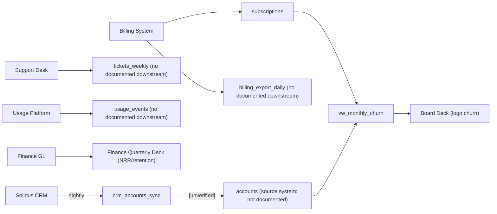

# Estate Map — Retention Reporting Data Flow  [Understand]
_Drawn 2026-06-09, by request of Marcus Okafor (analyst)._
_View: lineage/dataflow (flowchart LR). Scope: all objects named or handed as inputs to retention reporting, plus documented consumers._
**Derived from:** `knowledge-base/landscape.md` (2026-05-22) · `inputs/vw_monthly_churn.sql` (inherited, undated) · Marcus Okafor verbal 2026-06-09 — re-run this skill to refresh; `kb-reconcile` flags this map stale when the record outruns it.
_Coverage: 14 nodes · 9 evidenced edges · 1 unverified edge · 3 nodes with no documented downstream · 1 node (accounts) with undocumented source system._

## Edge ledger

| Edge | Kind | Evidence | Status |
|---|---|---|---|
| Billing System → subscriptions | system-of-record | landscape.md: "billing system (subscriptions, MRR, plan changes)" | evidenced |
| Billing System → billing_export_daily | extract/export | Marcus Okafor verbal, 2026-06-09: "the billing extract billing_export_daily" | evidenced (attributed) |
| Solidus CRM → crm_accounts_sync | nightly sync | Marcus Okafor verbal, 2026-06-09: "Solidus syncs account_id and segment nightly into crm_accounts_sync" | evidenced (attributed) |
| crm_accounts_sync → accounts | sync/join | none — Marcus: "I BELIEVE crm_accounts_sync joins billing on account_id but have never checked" | **[unverified]** — ask: does a job write CRM fields into the accounts table, or is this a runtime join somewhere? Which table is the authoritative target? |
| Support Desk → tickets_weekly | weekly export | Marcus Okafor verbal, 2026-06-09: "support desk exports tickets_weekly (account_id, opened_at, closed_at, severity)" | evidenced (attributed) |
| Usage Platform → usage_events | event stream | Marcus Okafor verbal, 2026-06-09: "product usage lands in usage_events (account_id, event_name, ts) since 2025-01" | evidenced (attributed) |
| subscriptions → vw_monthly_churn | SQL read | vw_monthly_churn.sql: active_start CTE (subscriptions WHERE status = 'active') and canceled_in_month CTE (subscriptions WHERE canceled_at IS NOT NULL) | evidenced |
| accounts → vw_monthly_churn | SQL JOIN | vw_monthly_churn.sql: `JOIN accounts acct ON acct.account_id = a.account_id` | evidenced |
| vw_monthly_churn → Board Deck | consumption | landscape.md: "the board deck currently pulls logo churn from vw_monthly_churn" | evidenced |
| Finance GL → Finance Quarterly Deck | GL-sourced build | landscape.md: "Finance's retention number is produced separately from the GL" | evidenced |

## Gaps (the map's yield)

1. **crm_accounts_sync → accounts [unverified]:** Does a nightly job write CRM segment data into the billing `accounts` table, or is this a runtime join in some query? If a write: which job, what target fields? → Ask Marcus or DBA.
2. **accounts source system:** Which system owns and populates `accounts`? Accessed alongside `subscriptions` in the view but its origin is documented nowhere on hand. → Check DDL.
3. **billing_export_daily downstream:** What reads this extract in the retention scope? Does it load `subscriptions`, or is it a separate analyst-facing feed? Marcus has the field list from the assumption audit. → Ask Marcus.
4. **tickets_weekly downstream:** Any current consumer, or candidate-input only for the future mart? → Ask Marcus.
5. **usage_events downstream:** Marcus: "no idea what reads usage_events downstream." → Check DB catalog / ask engineering.
6. **Board Deck vs Finance Quarterly Deck definitions (not a wiring gap — a business-definition gap):** vw_monthly_churn counts logo churn; Finance GL produces NRR. Never reconciled (landscape.md). Prerequisite for model-contract. → This is the first question for the next skill.
